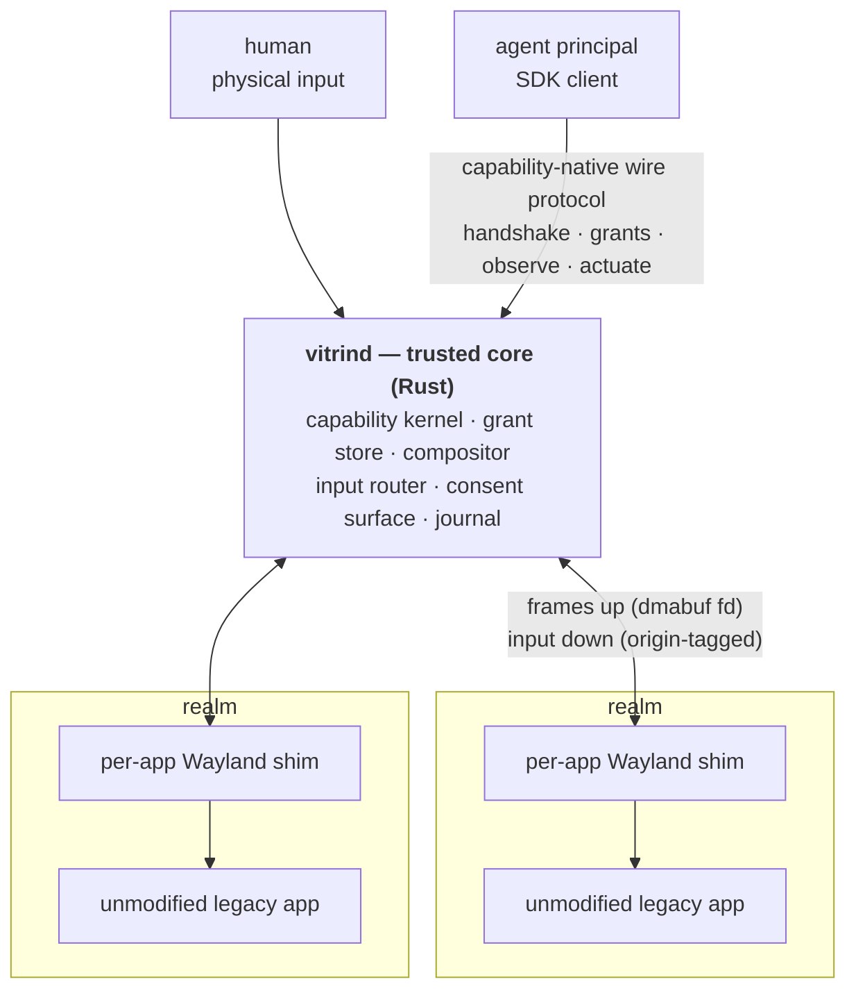

# Vitrin OS

[](https://github.com/vitrin-os/vitrin-os/actions/workflows/ci.yml)

Vitrin OS is an open-source, **agent-first display server**: a small trusted
core (`vitrind`) speaking a new capability-native wire protocol, with every
legacy Wayland/X11 application confined to its own per-app nested shim — so
that humans and AI agents can concurrently observe and operate GUIs under
granular, revocable, capability-scoped authorization. Every principal has
identity; every action carries a capability; every action is journaled; the
trusted core stays small and legacy complexity is exiled to disposable,
unprivileged shims.

The full vision, object model, and technical architecture live in
[docs/PRD.md](docs/PRD.md). The wire protocol is specified in
[protocol/vitrin-v0.xml](protocol/vitrin-v0.xml) with prose in
[docs/protocol/](docs/protocol/00-conventions.md).

## Why

Agents that drive desktops today work screenshot-by-screenshot: capture the
screen, pick pixel coordinates, click, capture again. The loop is slow,
token-hungry, and race-prone — and it runs with all-or-nothing authority. The
isolation unit is a whole VM or desktop session, so a single prompt-injected
agent's blast radius is everything on screen. There is no structural way to
say: *this agent may operate this one form in this one app, may not read the
password-manager window beside it, and loses all input the instant a human
touches the keyboard.*

The underlying stack cannot express that sentence. X11 grants every client
near-total authority over the session — that is its protocol model, not a
bug. Wayland achieved isolation by *removing* cross-client capabilities
rather than *mediating* them, and its `wl_seat` singleton has no notion of N
concurrent authenticated principals. AT-SPI2, the accessibility tree agents
use to avoid pixels, is an unauthorized backdoor onto every application's
widgets. The managed-cloud answers (AWS WorkSpaces for AI agents, Windows 365
for Agents) have the right instinct — identity per agent, audit, oversight —
but at whole-VM granularity, locked to proprietary clouds.

Vitrin is designed from day zero around the missing primitives:

- **Principals.** Every connection authenticates an identity (human or agent
  workload) at handshake; agent credentials are SPIFFE/OIDC-shaped.
- **Grants.** No ambient authority. A grant is (principal × resource × verbs
  × constraints — expiry, rate ceilings, focus conditions), sender-constrained
  to the connection, attenuable, and revocable — immediately and transitively.
- **Consent.** Rendered by the trusted core itself, which owns the screen and
  input, so prompts cannot be spoofed by any client.
- **Realms and shims.** Apps launch into realms; each legacy app gets its own
  private nested shim server, so its universe contains only itself — scoping
  is structural, not policy.
- **Human override.** Physical input preempts agent input by construction.

See [docs/PRD.md](docs/PRD.md) §1 for the full problem statement and §6 for
the pillar-by-pillar requirements.

## Status

**Early Phase 1.** The protocol layer is the only landed code; nothing is
runnable end-to-end yet.

What exists today:

- **Protocol spec v0** — [protocol/vitrin-v0.xml](protocol/vitrin-v0.xml)
  (11 interfaces, wire format, error taxonomy; the source of truth) and its
  RELAX NG schema [protocol/vitrin-v0.rng](protocol/vitrin-v0.rng).
- **Protocol prose** — normative
  [conventions](docs/protocol/00-conventions.md) plus one page per interface
  under [docs/protocol/](docs/protocol/00-conventions.md).
- **Codegen** — [`vitrin-scanner`](crates/vitrin-scanner) plus a
  `cargo xtask codegen` driver generate the
  [`vitrin-protocol`](crates/vitrin-protocol) Rust crate (message types +
  codec; pure data, no I/O) and the C header
  [shim/include/vitrin-protocol.h](shim/include/vitrin-protocol.h) from the
  IDL.
- **CI** — [.github/workflows/ci.yml](.github/workflows/ci.yml) validates the
  IDL against the schema, runs the test suite in debug and release with
  `-D warnings`, fails on generated-code drift (`cargo xtask codegen
  --check`), and pins the Rust codec and the C header to the same wire bytes
  with a golden-frame test.

What does not exist yet:

- **`vitrind` itself** — no compositor, capability kernel, grant store, or
  consent surface code has landed.
- **The shim binary** — `shim/` holds only the generated header and its C
  tests; the wlroots-based per-app shim is not started.
- **The agent SDK** — no Python SDK or demo agent yet.

Phase 1 is tracked as nine epics in the
[issue tracker](https://github.com/vitrin-os/vitrin-os/issues), one
`track:*` label each; only the protocol track has landed code so far.

## Architecture at a glance



The core is the entire trusted computing base: capability kernel and grant
store, scene composition, input routing, consent surface, journals. Legacy
apps never touch it directly — each is launched with `WAYLAND_DISPLAY`
pointing only at its own private shim, which is itself an unprivileged client
of the core. Frame buffers move as dmabuf file descriptors over `SCM_RIGHTS`
(zero-copy, one extra IPC hop — the gamescope/Qubes precedent). Window
management policy, decoration, and theming stay out of the core, permanently.

## Security notes — what the MVP does and does not confine

Vitrin's design claims are strong, and the Phase-1 MVP does not yet deliver
all of them. The gaps below are **deliberate, settled decisions with a
scheduled closure**, not oversights — and they are stated here, at the front
of the security story, rather than buried in a module doc, because a
half-believed confinement claim is worse than an honest gap.

**Realm confinement today is environment-structural only.** When the core
launches a realm's app it forks a per-app shim, hands it one end of a
socketpair as its identity (no credential, no handshake — holding the
descriptor *is* being that realm's shim), gives it a private `0700` runtime
directory, and builds its environment from nothing: only names the operator
allow-listed in `realm.toml`, plus a `WAYLAND_DISPLAY` pointing at that
realm's own private socket. `DISPLAY`, the host `WAYLAND_DISPLAY`,
`WAYLAND_SOCKET`, `XAUTHORITY` and the host `XDG_RUNTIME_DIR` cannot reach
the app at all. No unrelated descriptor of the core's — the agent listener,
the flight-recorder log, other realms' sockets, capture memfds — crosses the
fork, and the child starts from a defined signal state rather than inheriting
whatever the operator's shell happened to be ignoring. Both are enforced by
the fork itself (a `close_range` sweep and a disposition reset between `fork`
and `execve`), not by every other module remembering to be careful.

That is the complete list of what confines a realm right now.

- **No sandbox (decision D9, closes in Phase 2).** There are **no
  namespaces, no seccomp filter, and no Landlock policy**. The shim and its
  app run as the core's own uid with the core's full view of the filesystem
  and the network. An app that ignores `WAYLAND_DISPLAY` and connects
  directly to a path it already knows is not stopped by anything in the
  MVP. Real sandboxing arrives with the Phase-2 powerbox (E2.6/E2.7).
  Environment hygiene confines the well-behaved; it does not contain the
  hostile.
- **The session D-Bus is reachable (known hole, closes with P13 in Phase
  2).** The core advertises no `DBUS_SESSION_BUS_ADDRESS` and points
  `XDG_RUNTIME_DIR` at the realm's private directory, so a well-behaved
  client finds no bus. But advertisement is not reachability:
  `/run/user/<uid>/bus` is still on the filesystem and still connectable by
  any process of that uid, and the abstract-socket namespace is still
  shared. In practice, running Firefox — the Phase-1 acceptance app —
  means allow-listing `DBUS_SESSION_BUS_ADDRESS` explicitly, which turns
  the implicit hole into an audited one. This is a lateral-escape path of
  exactly the shape [PRD](docs/PRD.md) §15 catalogues (D-Bus activation of a
  privileged helper); **P13** closes it with a loopback-only network
  namespace plus an empty mount namespace, so that there is nothing to
  reach rather than nothing advertised.
- **Same-uid separation is not attempted.** The `0700` runtime directory
  bounds other *users* on the machine, not other processes of this user.
  Note what the realm's `XDG_RUNTIME_DIR` therefore is and is not: its value,
  `$XDG_RUNTIME_DIR/vitrin-0/<realm>`, sits one level below the directory
  holding the core's own agent socket and this run's flight-recorder log, so
  it names the control plane as much as it hides it. Redirecting it means a
  well-behaved client finds its own realm's socket instead of the host
  session's — it does not mean the app cannot reach the rest, because under
  D9 it runs as the core's uid and can derive those paths with or without a
  variable pointing at them.

The spawn path and every decision above are documented in full in
[`crates/vitrin-core/src/spawn.rs`](crates/vitrin-core/src/spawn.rs);
`realm.toml`'s own security rules are in
[`examples/realm.toml`](examples/realm.toml).

## Repository layout

| Path | What it is |
|---|---|
| [`docs/PRD.md`](docs/PRD.md) | PRD + Technical Architecture — the canonical vision/design doc |
| [`protocol/vitrin-v0.xml`](protocol/vitrin-v0.xml) | The wire-protocol IDL — source of truth for every interface |
| [`protocol/vitrin-v0.rng`](protocol/vitrin-v0.rng) | RELAX NG schema for the IDL dialect |
| [`docs/protocol/`](docs/protocol/00-conventions.md) | Normative conventions + one prose page per interface |
| [`crates/vitrin-protocol/`](crates/vitrin-protocol) | Generated message types + codec (no I/O, no sockets) |
| [`crates/vitrin-scanner/`](crates/vitrin-scanner) | Code generator: IDL XML → Rust + C header |
| [`crates/xtask/`](crates/xtask) | `cargo xtask codegen [--check]` — regenerate or drift-check the generated code |
| [`shim/include/`](shim/include) | Generated C header for the future wlroots shim |
| [`shim/tests/`](shim/tests) | C-side checks: header compiles standalone; frames match the Rust codec byte-for-byte |
| [`.github/workflows/ci.yml`](.github/workflows/ci.yml) | CI: schema validation, tests, codegen drift check, C header checks |

## Working with the repo today

The toolchain is pinned to Rust **1.94.1** in
[rust-toolchain.toml](rust-toolchain.toml); rustup installs it automatically
on the first `cargo` invocation. The pin is exact rather than `stable`
because `cargo xtask codegen --check` compares generated output byte-for-byte
and that output depends on rustfmt's exact formatting decisions (the codegen
shells out to `rustfmt`; the pinned toolchain's default profile ships it).
The crates' MSRV is 1.87. CI builds with `RUSTFLAGS="-D warnings"`.

```sh
# Validate the IDL against the RELAX NG schema (requires xmllint/libxml2)
xmllint --noout --relaxng protocol/vitrin-v0.rng protocol/vitrin-v0.xml

# Build and test the workspace — CI runs both debug and release
cargo test --workspace
cargo test --workspace --release

# Check that the generated Rust crate and C header match the IDL
cargo xtask codegen --check

# Regenerate them after editing protocol/vitrin-v0.xml
cargo xtask codegen

# C header: standalone compile + golden-frame check against the Rust codec
cc -std=c11 -Wall -Werror -I shim/include -c shim/tests/test_header_compiles.c -o /dev/null
cc -std=c11 -Wall -Werror -I shim/include shim/tests/test_golden_frames.c -o /tmp/golden && /tmp/golden
```

## Protocol v0 interfaces

The wire format (little-endian frames, 8-byte header, at most one fd per
message), object-id rules, ordering guarantee, error taxonomy, and versioning
rules are defined in [00-conventions.md](docs/protocol/00-conventions.md).
There are two connection classes sharing one wire format: agent principals on
the core's listening socket, and per-app shims on a core-inherited
socketpair. A grant petition co-mints the grant, a consent observer, and the
facets (view, pointer, text) in one request; facets are born inert and confer
nothing until the grant resolves. Where prose and IDL disagree, **the IDL's
`<description>` text wins.**

| Interface | Purpose |
|---|---|
| [`vitrin_handshake`](docs/protocol/01-vitrin_handshake.md) | Principal connection bootstrap: version + identity hello, resolving to a bound principal |
| [`vitrin_principal`](docs/protocol/02-vitrin_principal.md) | The authenticated principal — root of the connection's authority chain |
| [`vitrin_realm`](docs/protocol/03-vitrin_realm.md) | Realm address — an authority-free scope handle (v0 serves the single well-known `realm-0`) |
| [`vitrin_grant`](docs/protocol/04-vitrin_grant.md) | Capability handle — the wire projection of one grant-table row; born pending, resolved exactly once |
| [`vitrin_consent`](docs/protocol/05-vitrin_consent.md) | Consent-prompt visibility for one petition (events only, no authority) |
| [`vitrin_view`](docs/protocol/06-vitrin_view.md) | Observation facet — poll-model frame capture |
| [`vitrin_actuator_pointer`](docs/protocol/07-vitrin_actuator_pointer.md) | Pointer actuation facet |
| [`vitrin_actuator_text`](docs/protocol/08-vitrin_actuator_text.md) | Text actuation facet |
| [`vitrin_shim_session`](docs/protocol/09-vitrin_shim_session.md) | Shim connection bootstrap |
| [`vitrin_shim_surface`](docs/protocol/10-vitrin_shim_surface.md) | Shim-to-core buffer path |
| [`vitrin_shim_seat`](docs/protocol/11-vitrin_shim_seat.md) | Input delivery to the shim (events only, origin-tagged) |

## Roadmap

Condensed from [docs/PRD.md](docs/PRD.md) §8:

- **Phase 0 — Spec & manifesto.** Vision, object model, wire-protocol draft
  (the PRD in this repo).
- **Phase 1 — MVP slice** *(current)*. Trusted core (headless + nested), one
  wlroots Wayland shim, Firefox in a realm, and an agent that captures the
  realm and injects scoped input — gated by a single grant with consent
  rendered by the core.
- **Phase 2 — Semantic + epochs.** AccessKit/AT-SPI2 bridge, versioned and
  diffable semantic trees, epoch/CAS action semantics, VLM fallback for
  treeless surfaces, native semantic demo app, filesystem powerbox v0,
  network authority v0 (per-realm loopback-only netns, egress as a grant).
- **Phase 3 — Network + X11 + fleet.** QUIC network sessions, per-app X11
  shim with embedded WM, multi-realm headless fleet mode, journal replay
  tooling, synthetic-path FUSE layer, credential wallet v0, mission-control
  shell v0.
- **Phase 4 — Horizon.** Session mode on bare DRM/KMS, Flutter/iced/egui
  semantic backends, capability-remoting protocol hardened for third-party
  clients, EUDI/OID4VC conformance — entered only when adoption justifies the
  support burden.

## Contributing

Work is tracked as GitHub issues in
[vitrin-os/vitrin-os](https://github.com/vitrin-os/vitrin-os/issues). Phase 1
is split into nine epics, each carrying exactly one `track:*` label
(`track:protocol`, `track:rust-core`, `track:c-shim`, `track:sdk`,
`track:ci-docs`), sequenced by milestones `M1.1`–`M1.5`.

- **Branches**: `p<phase>.<epic>.<task>-slug`, e.g. `p1.1.1-protocol-idl`.
- **Commits**: [Conventional Commits](https://www.conventionalcommits.org/),
  `type(scope): summary`, where scope is the track (`protocol`, `rust-core`,
  `c-shim`, `sdk`, `ci-docs`) or `root`. Reference the tracking issue in the
  footer (`Closes #10` / `Refs #10`).
- **Protocol changes are paired edits, never one alone**: change
  `protocol/vitrin-v0.xml` (and `protocol/vitrin-v0.rng` only if the dialect
  itself changes) together with the matching `docs/protocol/NN-*.md` page,
  then validate with `xmllint --noout --relaxng protocol/vitrin-v0.rng
  protocol/vitrin-v0.xml`. After IDL edits, run `cargo xtask codegen` and
  commit the regenerated code in the same change.
- **Language**: English only — code, docs, commits, issues, PRs.

## License

[Apache-2.0](LICENSE).
