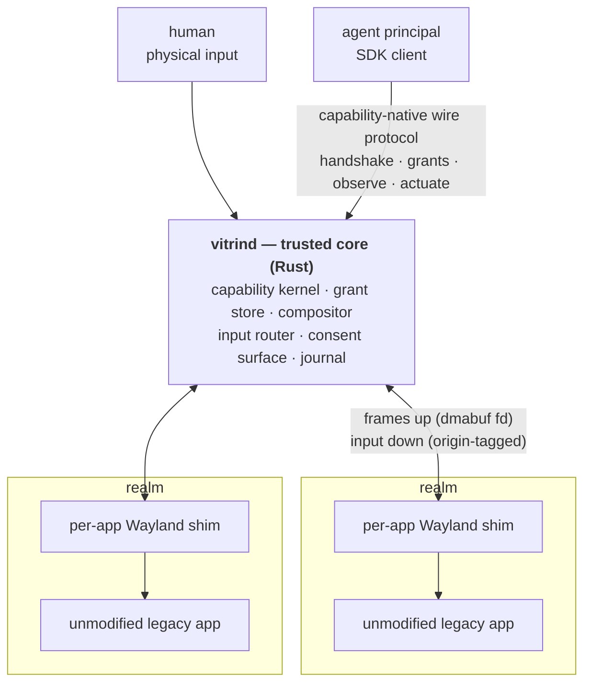

<p align="center">
  
  
</p>

<p align="center">
  <a href="https://github.com/vitrin-os/vitrin-os/actions/workflows/ci.yml"></a>
  <a href="NOTICE"></a>
  <a href="docs/plan/01-phase-1-mvp.md"></a>
</p>

Vitrin OS is an open-source, **agent-first display server**: a small trusted
core (`vitrind`) speaking a new capability-native wire protocol, with every
legacy [Wayland](https://wayland.freedesktop.org/)/X11 application confined to its own per-app nested shim — so
that humans and AI agents can concurrently observe and operate GUIs under
granular, revocable, capability-scoped authorization. Every principal has
identity; every action carries a capability; every action is journaled; the
trusted core stays small and legacy complexity is exiled to disposable,
unprivileged shims.

The full vision, object model, and technical architecture live in
[docs/PRD.md](docs/PRD.md). The wire protocol is specified in
[protocol/vitrin-v0.xml](protocol/vitrin-v0.xml) with prose in
[docs/protocol/](docs/protocol/00-conventions.md).

## What it looks like

One sentence, no jargon:

> An agent is allowed to fill in one form, in one Firefox window, for the
> next five minutes. It cannot see the password manager open beside it. The
> moment you touch the mouse, you have control back. Hold Escape for a
> second and its authority is gone — mid-click, mid-keystroke, whatever it
> was doing.

Every clause there is a mechanism, not a policy setting:

| The claim | What makes it true |
|---|---|
| *allowed to fill in one form* | A **grant**: (principal × resource × verbs × constraints). Not a role, not a config flag — a row in the grant table the core checks on every single action. |
| *for the next five minutes* | Expiry is a constraint **on the grant**, enforced at the chokepoint. There is no path that skips it. |
| *cannot see the password manager* | The agent's Firefox is in a **realm**, talking to its own private nested shim. The other window is not "hidden" from it; it is not in its universe. Scoping is structural. |
| *you touch the mouse, you have control* | Physical input is origin-tagged at the core and preempts agent input **by construction**, not by a race between two clients. |
| *hold Escape and its authority is gone* | The **dead-man switch**: the core revokes every live grant, and the agent's next call fails `revoked`. Proven against a real app in `test_real_deadman.py`. |

The prompt that asks you to approve any of this is drawn by the trusted core
itself — the thing that owns the screen — so no client can paint a fake one
over it. That property has its own gate (`test_real_consent.py`): the prompt
is shown to occlude the app's real pixels while the agent's own capture path
sees the app unchanged.

## Why

Agents that drive desktops today work screenshot-by-screenshot: capture the
screen, pick pixel coordinates, click, capture again. The loop is slow,
token-hungry, and race-prone — and it runs with all-or-nothing authority. The
isolation unit is a whole VM or desktop session, so a single prompt-injected
agent's blast radius is everything on screen. There is no structural way to
say: *this agent may operate this one form in this one app, may not read the
password-manager window beside it, and loses all input the instant a human
touches the keyboard.*

The underlying stack cannot express that sentence. [X11](https://www.x.org/wiki/) grants every client
near-total authority over the session — that is its protocol model, not a
bug. Wayland achieved isolation by *removing* cross-client capabilities
rather than *mediating* them, and its `wl_seat` singleton has no notion of N
concurrent authenticated principals. [AT-SPI2](https://gitlab.gnome.org/GNOME/at-spi2-core), the accessibility tree agents
use to avoid pixels, is an unauthorized backdoor onto every application's
widgets. The managed-cloud answers ([AWS WorkSpaces](https://aws.amazon.com/workspaces/ai-agents/) for AI agents, [Windows 365](https://www.microsoft.com/en-us/windows-365/agents)
for Agents) have the right instinct — identity per agent, audit, oversight —
but at whole-VM granularity, locked to proprietary clouds.

Vitrin is designed from day zero around the missing primitives:

- **Principals.** Every connection authenticates an identity (human or agent
  workload) at handshake; agent credentials are [SPIFFE](https://spiffe.io/)/OIDC-shaped.
- **Grants.** No ambient authority. A grant is (principal × resource × verbs
  × constraints — expiry, rate ceilings, focus conditions), sender-constrained
  to the connection, attenuable, and revocable — immediately and transitively.
- **Consent.** Rendered by the trusted core itself, which owns the screen and
  input, so prompts cannot be spoofed by any client.
- **Realms and shims.** Apps launch into realms; each legacy app gets its own
  private nested shim server, so its universe contains only itself — scoping
  is structural, not policy.
- **Human override.** Physical input preempts agent input by construction.

See [docs/PRD.md](docs/PRD.md) §1 for the full problem statement and §6 for
the pillar-by-pillar requirements.

## Status

**Phase 1 is complete**, and there is a
[**60-second recording**](https://vitrin-os.github.io/vitrin-os/#demo) of it
working: the core-drawn consent card over a real Firefox, a human clicking
Allow, the agent filling a record it was handed, and — in a second take — a
physically held Escape revoking every grant mid-task so the run exits non-zero.
Two takes rather than one, because a revoked run cannot also print `PASS`.

All nine epics (E1–E9) have landed on `main`, and
every milestone's named acceptance gate is closed under the rule this
project holds itself to — decision **D12**: *a milestone closes only when a
named integration test passes green against the shipped binaries with no
mock on any seam it claims.* Component tests built on
[`vitrin-mock-shim`](crates/vitrin-mock-shim) are never that evidence, and
are labelled as what they are.

| Milestone | Gate | Proven by |
|---|---|---|
| **M1.2** — buffer path | [#105](https://github.com/vitrin-os/vitrin-os/issues/105) | `tests/integration/test_real_app.py` — real core + real shim + real `weston-terminal` |
| **M1.3** — observation | [#107](https://github.com/vitrin-os/vitrin-os/issues/107) | `test_real_capture_fidelity.py` — an agent observes a real app through the enforcement chokepoint |
| **M1.4** — actuation, consent, dead-man | [#108](https://github.com/vitrin-os/vitrin-os/issues/108) + [#109](https://github.com/vitrin-os/vitrin-os/issues/109) + [#138](https://github.com/vitrin-os/vitrin-os/issues/138) | `test_real_actuation.py`, `test_real_deadman.py`, `test_real_consent.py` |
| **M1.5** — demo | [#110](https://github.com/vitrin-os/vitrin-os/issues/110) | `test_demo.py` — the demo agent is handed a task record it did not author, fills it into a real app and submits it, and the gate demands the confirmation carry *that record's* 36-bit checksum (a positive content check, not a pixel diff) plus the app's own byte-exact report. The app, `form-target`, is repo-authored — a real Wayland client, no mock, but less independent than the `weston-terminal` it replaced; disclosed in [`examples/agent-demo/README.md`](examples/agent-demo/README.md) and the D12 seam table |

What exists today, on `main`:

- **Protocol spec v0** — [protocol/vitrin-v0.xml](protocol/vitrin-v0.xml)
  (16 interfaces at wire version 2, wire format, error taxonomy; the source of truth), its
  RELAX NG schema [protocol/vitrin-v0.rng](protocol/vitrin-v0.rng), and a
  prose page per interface under [docs/protocol/](docs/protocol/00-conventions.md)
  kept in lockstep with every landing PR.
- **Codegen** — [`vitrin-scanner`](crates/vitrin-scanner) plus
  `cargo xtask codegen` generate the [`vitrin-protocol`](crates/vitrin-protocol)
  Rust crate (message types + codec; pure data, no I/O) and the C header
  [shim/include/vitrin-protocol.h](shim/include/vitrin-protocol.h) from the
  IDL.
- **`vitrind`, the trusted core** ([`crates/vitrin-core`](crates/vitrin-core))
  — a real [Smithay](https://github.com/Smithay/smithay) compositor with three output backends (`--nested`, a host
  Wayland client; `--headless --size WxH`, GPU-less pixman software
  rendering for CI; and `--drm`, the display controller itself — mode setting,
  a GBM swapchain, libinput and libseat — compiled only under the non-default
  `drm-backend` feature, because two of the crates it pulls `.unwrap()` a
  pkg-config probe in their build script and panic a build without the
  graphics dev packages. CI compiles that backend and runs its device-free
  unit tests; it sets no mode, commits no frame and delivers no key, because a
  runner has no display controller, no seat and no GPU — see [what session mode
  does not give you](#running-it-as-a-desktop-what-session-mode-does-not-give-you));
  the capability kernel and in-memory grant table
  (request → pending → consent → resolved, sender-constrained, rate-limited,
  revocable); the realm/spawn manager (fork/exec the shim with a private
  runtime dir and a scrubbed, allow-listed environment); the core-rendered
  consent prompt with an exclusive input grab; the hold-Esc dead-man
  revocation switch; the
  [dmabuf](https://docs.kernel.org/driver-api/dma-buf.html) import path
  ([`dmabuf.rs`](crates/vitrin-core/src/dmabuf.rs) — zero-copy shim→core
  frames on a real GPU, with shm as the universal fallback and an explicit
  `buffer_done(import_failed)` event rather than a silent black frame, so CI
  stays GPU-free); and the flight-recorder log. See the
  [Architecture at a glance](#architecture-at-a-glance) section and
  [docs/ARCHITECTURE.md](docs/ARCHITECTURE.md) for the full crate↔PRD map.
- **The Wayland shim** ([`shim/`](shim/README.md)) — a [wlroots](https://gitlab.freedesktop.org/wlroots/wlroots) headless
  compositor, C + [Meson](https://mesonbuild.com/), outside the Cargo workspace by design. It forwards
  every composited frame to the core over the inherited socketpair, replays
  origin-tagged input into the app through its own `wl_seat`, and runs real
  apps: `weston-terminal`, a [GTK](https://www.gtk.org/) entry probe, and [Firefox ESR](https://www.mozilla.org/en-US/firefox/enterprise/) (pinned),
  climbed one rung at a time and proven in CI with no mock on the shim seam.
- **The agent SDK** ([`sdk/python/`](sdk/python)) — a pure-Python
  (stdlib-only, D8) wire client: connect → handshake → `request_grant` →
  `observe()` → `actuate_pointer`/`actuate_text`, typed grant-error
  exceptions, and capture ergonomics (`.to_png()`).
  [`examples/agent-demo/run_demo.py`](examples/agent-demo/run_demo.py) is
  the demo agent and doubles as the M1.5 integration test; run it with
  `cargo xtask demo` (see [Quickstart](#quickstart) below).
- **The switcher, as a client**
  ([`examples/shell/`](examples/shell/README.md)) — moving the output between
  realms and launching a realm template are done by an ordinary SDK client
  holding `layout.focus`, `layout.arrange` and `realm.launch` through the
  normal consent path, because PRD §5.1 keeps window-management policy out of
  the core. It is **not** a desktop shell and does not become one: it is
  line-oriented because a principal cannot draw (`vitrin_view` is
  capture-only; there is no principal-facing surface interface), and it has no
  hotkey because a principal cannot receive physical input (there is no
  `observe_input` verb). Both are structural gaps, both are published in
  [`docs/book/src/limits.md`](docs/book/src/limits.md), and so is the cost:
  kill the shell and the session survives with the last-focused realm still
  taking your input, but nothing can re-aim it until you start one again.
- **CI** — [.github/workflows/ci.yml](.github/workflows/ci.yml): Rust
  fmt/clippy/tests (debug + release), IDL schema validation and
  generated-code drift checking, a Rust-free container build of the C shim,
  golden-frame pixel/SSIM checks, and a headless integration suite that
  drives the real core against real apps (`weston-terminal`, GTK, Firefox
  ESR) with a hard 10-minute budget.

### What Phase 1 does *not* give you

Phase 1 being complete is a statement about a defined slice, not about
readiness for anything real. Read this list before the pitch above
convinces you of more than it should.

- **Half a sandbox (decisions D9, D-020, D-036).** Since P2.6.2 a realm gets
  six namespaces, an identity uid/gid map, zero capabilities and a private
  mount table it cannot reshape — all verified by the core from outside. But
  since P2.6.3 it also gets a [Landlock](https://landlock.io/) ruleset with an
  enumerated read set, enforced before the shim's `execve`, and a generated
  [ABI matrix](docs/book/src/isolation-matrix.md) of what this build requires
  of a kernel. The *per-kernel* half the task's criteria ask for now exists
  separately and is measured — [which kernels this build starts
  on](docs/book/src/isolation-kernels.md) boots five distribution kernels under
  QEMU with the shipped `vitrind` (reported ABI 1, 2, 4, 6 and 7; three refused
  below the floor, two admitted) — but those are **kernel** readings taken in a
  bare initramfs, so the number of *distributions* measured as such is still
  one. Since P2.6.4
  ([#188](https://github.com/vitrin-os/vitrin-os/issues/188)) there is also a
  [seccomp](https://man7.org/linux/man-pages/man2/seccomp.2.html) filter, and
  it is a **deny-list** — a named-class claim, never a completeness one. It
  closes the 13 denied syscall rows `vitrind --print-seccomp` prints, each
  naming the escape class it answers and the errno it returns, and leaves the
  rest of the
  kernel's syscall surface **unenumerated**. So a realm is path-confined and
  *filtered against a named list*; it is **not** syscall-confined. 11 of the
  13 denied syscall rows are demonstrated against a positive control on the
  kernel this was measured on; two are already denied by a sysctl there and are reported
  *not demonstrated* rather than counted. The realm also keeps the invoking
  user's supplementary groups, which the kernel gives no window to drop.
  Environment hygiene confines the well-behaved; it does not contain the
  hostile. This is still the big one — see
  [Security notes](#security-notes--what-the-mvp-does-and-does-not-confine).
- **The 24-hour fuzz soak has not been run**
  ([#156](https://github.com/vitrin-os/vitrin-os/issues/156))**.** `fuzz/`
  ships two cargo-fuzz targets (protocol decode, `vitrin-ipc` framing) with a
  checked-in corpus CI replays on every PR plus a short per-PR burst, but the
  24-hour clean run the plan asks for is still a manual, documented procedure
  rather than a scheduled job — [fuzz/README.md](fuzz/README.md) says so in
  its own words. Nobody has run it end to end.
- **wlcs conformance is advisory and mostly red**
  ([#157](https://github.com/vitrin-os/vitrin-os/issues/157))**:**
  `total=180 passed=3 failed=145 skipped=32` on the 2026-07-25 run, against
  wlcs 1.6.1-1. The version belongs beside the numbers: the same shim scores
  8/49 against wlcs 1.7.0 with no shim change in between, so a ratio from this
  harness means nothing on its own. That number is expected and
  is not a bug count — [wlcs](https://github.com/canonical/wlcs) tests a
  general-purpose desktop compositor, and the shim deliberately serves a
  narrow surface (no touch, no full `xdg-shell` policy, no decoration
  protocols), so most failures are "no such global" rather than misbehaviour.
  It is still the honest number, it has **not** been re-measured since, and
  `shim/wlcs/README.md` distinguishes the structural absences from the
  genuine ones. Never built by default; never gates a PR.
- **One maintainer.** Governance is a documented BDFL
  ([plan §5](docs/plan/12-workstream-community.md)); bus factor is tracked
  as a first-class project risk, not waved away.
- **v0 protocol, and it will break.** The IDL is frozen for Phase 1, not
  forever — Phase 2 adds semantic trees and epoch/CAS action semantics, and
  v0 clients should expect to move.

Nothing above is discovered-by-a-reader; each is a decision with a recorded
rationale in [docs/plan/20-decision-log.md](docs/plan/20-decision-log.md).

### Running it as a desktop: what session mode does not give you

Since Phase 1 closed, a workstream has been making `vitrind` drive a real panel
on one laptop (`--drm`), with a lock screen, an idle blank, a status strip, a
screenshot key and a cross-realm clipboard. **It looks like a desktop, which is
exactly when unstated gaps mislead**, so the list below is published here rather
than left to be discovered. Every item is argued out at length on
[`docs/book/src/limits.md`](docs/book/src/limits.md); this is the short form, and
neither surface is allowed to say something the other contradicts —
`cargo xtask limits-check` fails the build if either drops a claim it holds, if
one page contradicts *itself*, or if the code stops matching one. It holds a
named subset of what these pages say rather than every sentence on them, and
[what it does not
hold](docs/book/src/limits.md#what-holds-this-page-to-the-others-and-what-it-does-not)
is written down there — a gap recorded only in the checker's source code is
recorded only for the person who already knows. **Every bullet names the issue behind it, or says
plainly that it has none and why** — a published limit with nothing tracking it
is a different promise from one that is scheduled.

- **No accessibility of any kind.** No screen reader, no magnifier, no on-screen
  keyboard, no sticky or slow keys, no high-contrast or reduced-motion signal,
  and no **AT-SPI2** bus *advertised* to a realm. Read that word as carefully as
  the portals bullet below asks you to: the core injects no
  `DBUS_SESSION_BUS_ADDRESS` and repoints `XDG_RUNTIME_DIR`, so a well-behaved
  toolkit finds no `org.a11y.Bus` — but at `--isolation=off` the host session
  bus, which is where that name is activated, is still on the filesystem and
  still connectable by any process of this uid, and an operator running Firefox
  allow-lists `DBUS_SESSION_BUS_ADDRESS` and thereby hands that realm the host's
  accessibility bridge too. **This is a missing service, never a confinement**;
  at `--isolation=default` what closes that route is the kernel rather than this
  absence — the realm's `/run` holds one entry, `vitrin`, and abstract sockets
  are scoped to the realm's own network namespace, so the same allow-list line
  names a bus that is not there, unless that same operator names a host path in
  `binds` and puts the socket back inside the realm under a key that says
  nothing about buses. That is the reachability half
  [#160](https://github.com/vitrin-os/vitrin-os/issues/160) named, delivered by
  the kernel; the *designated-egress* half — reachability as a granted,
  host:port-scoped capability rather than as nothing at all — is still P13's and
  unbuilt. It is read off the mount table rather than measured, and the
  adversarial probe that would prove it (Phase 2's P2.1.10) does not exist yet.
  The semantic tree Phase 2 builds
  ([#175](https://github.com/vitrin-os/vitrin-os/issues/175)) is derived
  from accessibility technology and is **not a substitute for it**: it serves an
  agent, over this project's own wire protocol, under a grant a human approved.
  It does not make Orca work. This is stated as an **exclusion, not a deferral** —
  PRD §5.3 puts human accessibility inside the horizon phase's support treadmill,
  and that phase's M4 entry gate is unmet on every threshold. **No issue tracks
  it, deliberately**: an issue would imply somebody intends to close it, and
  nobody has said so.
- **CI structurally cannot test the daily-driver backend.** A GitHub runner has
  no DRM device, no seat and no GPU. The one job that touches this code is named
  `drm-compile-check (COMPILE ONLY - no display controller is touched)` and that
  is the whole of what it proves: the code type-checks. It sets no mode, commits
  no frame and delivers no key. **Where this README or the limits page cites
  hardware, it cites a dated run by one person on one laptop**, never a green
  tick. The compile rung came with [#218](https://github.com/vitrin-os/vitrin-os/issues/218); **the functional gate has no
  issue, because no change to CI could ever produce one.**
- **No X11.** Wayland only. There is **no X server anywhere in this stack** — not
  in the core, not among the globals a shim advertises, not as a process anything
  here starts — and a realm's app is handed no `DISPLAY` at all, so `xterm` in a
  realm dies with `Can't open display`. Per-app X11 with an embedded window
  manager is Phase 3 (E3.2) — measured and scoped by [#221](https://github.com/vitrin-os/vitrin-os/issues/221), and E3.2
  itself has no issue yet. Until it lands the maintainer keeps **a second
  session on another virtual terminal for X11-only software**, so *"I did not
  have to go back to my old compositor"* is false for that set of programs. That
  is a workaround he accepts, not something this project offers or confines: the
  second session is another compositor with full access to the same devices, and
  switching to it leaves the confined world entirely. What has actually been run,
  with the observable each run checked, is
  [the session app matrix](docs/book/src/session-app-matrix.md).
- **No bars, launchers, notifications or OSD.** `zwlr_layer_shell_v1` is not in
  the shim's global contract — measured, not assumed: waybar connects, binds six
  globals and never maps a surface. A principal cannot draw at all, so the
  replacements are core-owned surfaces (the trusted band, the consent card, the
  lock screen, the status strip) that no client can add to, and the shipped
  switcher is a line-oriented program in a host terminal ([#211](https://github.com/vitrin-os/vitrin-os/issues/211),
  [#215](https://github.com/vitrin-os/vitrin-os/issues/215)). Serving a layer shell has no issue and is not planned.
- **No portals, and that absence is a missing service rather than a
  confinement.** There is no `xdg-desktop-portal` here and a realm is advertised
  no session bus, so no portal file chooser, no screen sharing, no notifications,
  no "open this link". It buys **no security**: at `--isolation=off` the host bus
  is still on the filesystem and still connectable by any process of this uid —
  see [Security notes](#security-notes--what-the-mvp-does-and-does-not-confine).
  At `--isolation=default` what closes that route is the confinement rather than
  this row: the realm's `/run` holds one entry, `vitrin`, and abstract sockets
  are scoped to the realm's own network namespace, so an operator who allow-lists
  `DBUS_SESSION_BUS_ADDRESS` there hands the realm a variable naming something
  that is not there — unless that same operator names a host path in `binds`,
  which puts the socket back inside the realm under a key that says nothing about
  buses. Read that as a consequence of how the mount table is built rather than
  as a measurement. It is the reachability half
  ([#160](https://github.com/vitrin-os/vitrin-os/issues/160)) that the kernel
  delivered; the *designated-egress* half is still P13's and unbuilt, and
  **serving portals properly has no issue at all.**
- **A shell crash loses window management.** The switcher is an unprivileged
  client by design, so there is no core-side fallback. Kill it and the core, the
  realms and their apps all survive and the last-focused realm keeps taking your
  input; what you lose is the ability to re-aim it, and recovering means starting
  the shell again from a terminal that must already be in the bound realm.
  Asserted by `tests/integration/test_shell.py` ([#211](https://github.com/vitrin-os/vitrin-os/issues/211)); **it is the
  price of the shell-is-a-client invariant and has no issue, because nobody
  intends to close it.**
- **One machine, one GPU, one panel, one kernel — and the core models exactly
  one output**, by contract rather than by omission. There is no hardware
  matrix. A second connected display is
  refused at startup rather than half-served, so a laptop plus an external
  monitor does not work. The laptop's second GPU is **entirely unexercised**
  rather than "supported and untested": the backend opens the seat's primary GPU
  and there is no multi-GPU or PRIME path in this repository at all. The
  one-output refusal came with [#218](https://github.com/vitrin-os/vitrin-os/issues/218); **the hot-plug gap it leaves — a
  panel plugged in or unplugged mid-session — has no issue.**
- **At most 16 realms, and nothing you can ask for ends one.** Those are the
  session's cardinalities: up to **16 realms**, one output, one realm visible.
  No principal and no wire request closes a realm — revocation, disconnect and
  the dead-man switch all leave the process
  running ([#234](https://github.com/vitrin-os/vitrin-os/issues/234)) — and a
  slot comes back **only** when the realm's own app exits, which the core counts
  (`Realm::occupies_capacity`) so a session that launched and closed sixteen
  apps is not permanently spent. Sixteen *simultaneously live* realms is the
  cap; your remedies for a realm you no longer want are the app's own quit path,
  killing it from a terminal, or restarting `vitrind`. The cap itself is [#208](https://github.com/vitrin-os/vitrin-os/issues/208).
- **The cross-realm clipboard exists, and it is published as a bound rather than
  an absence.** Two physical human gestures move `text/plain;charset=utf-8`, up
  to **60 KiB** at a time, one direction each, through a single core-held slot
  that no client can trigger, force or observe. Two colluding realms can
  therefore move ~60 KiB per gesture pair; Qubes accepts the same bound. The
  honest statement is that number, never "there is no channel" ([#213](https://github.com/vitrin-os/vitrin-os/issues/213)).
- **A locked screen, and a dark screen, do not stop an agent.** An `observe`
  holder keeps capturing across a lock and across an idle blank, and an
  `actuate_*` holder keeps acting: a lock takes away *your* input, not an
  agent's authority. The instrument for "stop everything" is the dead-man chord,
  which fires through both. And **`--blank-idle` blanks the screen without
  locking it** — anyone who touches a key on your dark laptop is inside your
  session, because blanking and locking are deliberately not coupled.
  A blank is **worse than a lock** for the agent, and the limits page does not
  soften it: with the display off there are no vertical blanks, so every realm's
  frame clock stops and the agent is served the pre-blank frame **indefinitely,
  with no staleness signal and no refusal** — it can still act and cannot see the
  consequences, on a timer nobody chose. Both are
  decisions rather than gaps — the lock's is [#214](https://github.com/vitrin-os/vitrin-os/issues/214) and D-025, the
  blank's is [#223](https://github.com/vitrin-os/vitrin-os/issues/223) and D-033 — and **neither has an issue to close,
  because neither is going to change.**
- **There is no touch and no tablet on the wire.** The seat serves a pointer and
  a keyboard; `wl_touch` is deliberately not advertised, because a class announced
  with nothing behind it makes toolkits drop their pointer fallbacks. Both are
  deferrals with named reopening evidence (a device in the measured set plus an
  application that needs it), not refusals
  ([#222](https://github.com/vitrin-os/vitrin-os/issues/222)).
- **Idle inhibition is served, and bounded three ways.**
  `zwp_idle_inhibit_manager_v1` is advertised and relayed to the core over
  `vitrin_shim_session.idle_inhibit`
  ([#306](https://github.com/vitrin-os/vitrin-os/issues/306), D-042). Only the
  realm your output is bound to can hold one; it suppresses the idle **blank**
  and never the idle **lock**, so a film longer than `--lock-idle` still gets a
  lock screen over it; and **nobody has watched a video on real hardware and
  confirmed the panel stayed lit** — a blank needs a display controller and CI
  has none ([#223](https://github.com/vitrin-os/vitrin-os/issues/223) owns the
  blank's hardware rungs).
- **The volume keys reach an app that cannot act on them; the brightness keys
  now work, narrowly.** Neither is dropped at intake any more. For volume that
  changed *where they stop* and not what they do — a confined app cannot open a
  mixer, so pressing volume still does nothing, and mixer actuation stays
  deferred behind a shell verb or an owner decision, with **no issue tracking
  it.** Brightness closed with D-041
  ([#303](https://github.com/vitrin-os/vitrin-os/issues/303)): on `--drm` and
  only when started with `--backlight`, the core consumes both brightness keys
  and writes `/sys/class/backlight` itself, 5% of `max_brightness` per press and
  **never below 5%** — both rounded *up* and never smaller than one raw unit, so
  a panel whose ceiling is 10 moves by 1 (which is 10%) rather than by nothing,
  and the floor is a floor rather than a number the arithmetic rounds through.
  It does nothing for an external display, nothing without the
  flag, nothing on nested or headless (where the flag is refused), and the two
  keys stop reaching your apps as the price. No agent can trigger it: there is
  no verb and no wire message, only a physical key press.
- **A held key does not repeat on `--drm`.** The shim's repeat timer is set to
  zero on purpose — repeat is seat-wide and this seat carries an agent's
  actuations beside yours — but the core-side repeat that decision assumes was
  never written, and libinput synthesizes none. Nested, the host repeats and you
  never see it. **No issue tracks it**, and no run has confirmed it: this one was
  found by reading the tree during this sweep.
- **The trusted band's automated witness covers the headless backend only.** The
  band's unspoofability is machine-checked where CI can read a framebuffer and
  asserted, not checked, on the bare-metal backend a human would actually look
  at. Nobody has evidence a human *notices* a wrong band either
  ([#173](https://github.com/vitrin-os/vitrin-os/issues/173)).
- **What hardware has confirmed, at the depth it confirmed it.** The bring-up
  runbook ran twice on 2026-08-09 and the session-lifecycle checklist once on
  2026-08-11; neither was a clean pass. The 2026-08-11 run recorded 10 of 10 VT
  switches, **4 of 5** suspend cycles, **2 of 5** lid cycles of which one reached
  sleep, a blank at 61.2 s and no lock card on wake. The rungs filed **four
  defects (#257–#260)** and a **fifth (#268)** came out of driving alacritty and
  nautilus in the same session, so count five against that date. Two of those
  fixes are still unobserved on hardware. One run on one laptop is a report
  about that laptop.

## Quickstart

From a clean clone to a running demo. Verified against the state of `main`
described above (headless venue; the nested venue additionally needs a
Wayland session and Firefox ESR — see the note at the end).

The demo runs the **real** wlroots shim in both venues, so unlike a
Rust-only build it needs the C shim built and a real Wayland client
installed. `cargo xtask demo` fails with the exact `meson` command below if
the shim is missing, rather than silently substituting anything.

```sh
git clone https://github.com/vitrin-os/vitrin-os.git
cd vitrin-os

# The toolchain is pinned (rust-toolchain.toml); rustup installs it on the
# first cargo invocation. System deps the workspace links, plus the C
# shim's build deps and a real Wayland client for it to run:
sudo apt-get install -y libxkbcommon-dev libpixman-1-dev weston   # Debian/Ubuntu
bash shim/ci/install-deps.sh                                      # Meson + wlroots deps

# Build vitrind, xtask, and the fixtures the test suites use.
cargo build --workspace

# Build the real per-app wlroots shim (C + Meson, outside the Cargo
# workspace). cargo xtask demo looks for it at shim/build/vitrin-shim, or
# wherever VITRIN_C_SHIM_BIN points.
meson setup shim/build shim && meson compile -C shim/build

# Run the Phase-1 demo agent headless: boots vitrind --headless, which
# execs the real shim, which fork/execs a real Wayland client (form-target,
# co-built with the shim) in its own confined Wayland socket, and drives
# examples/agent-demo/run_demo.py over a real Unix socket. The agent is
# handed a task record it did not author, locates each form field by its
# marker colour in its own captured frame, clicks, types the value, clicks
# the located submit button, and then decodes the confirmation's three
# receipt bands -- a 36-bit checksum of the record the app received,
# computed from the SUPPLIED task at runtime. Exits non-zero on any failure.
cargo xtask demo --headless

# ... or with a record the agent has never seen:
cargo xtask demo --headless --task name=Grace --task email=grace@example.net
```

Expect output ending in `xtask demo: PASS` and a path to the run's flight
recorder (`flight.jsonl`) and captured frames. This exercises the real wire
protocol, the real capability kernel, the real consent auto-approve path,
the real wlroots shim, and a real app — `vitrin-mock-shim` appears in no
demo venue ([#110](https://github.com/vitrin-os/vitrin-os/issues/110) /
[#127](https://github.com/vitrin-os/vitrin-os/pull/127)); it survives only
as a unit-test fixture for the component tests in `tests/integration/`.

The same chain under the full integration suite, including the named
milestone gates:

```sh
VITRIN_C_SHIM_BIN="$PWD/shim/build/vitrin-shim" bash tests/integration/run.sh
```

**Nested mode** (`cargo xtask demo`, no `--headless`) draws a real window on
your own Wayland session and launches Firefox ESR in the realm — it needs a
running compositor (GNOME, Hyprland, ...) and `firefox-esr` (or
`VITRIN_DEMO_FIREFOX=/path/to/firefox`) on the machine you run it on; it is
never a CI dependency (nested mode has no headless equivalent by design —
plan risk R1).

Other useful commands, all covered in CI:

```sh
xmllint --noout --relaxng protocol/vitrin-v0.rng protocol/vitrin-v0.xml  # validate the IDL
cargo test --workspace && cargo test --workspace --release              # unit + integration tests
cargo xtask codegen --check                                              # generated-code drift check
```

## Architecture at a glance



The core is the entire trusted computing base: capability kernel and grant
store, scene composition, input routing, consent surface, journals. Legacy
apps never touch it directly — each is launched with `WAYLAND_DISPLAY`
pointing only at its own private shim, which is itself an unprivileged client
of the core. Frame buffers move as dmabuf file descriptors over `SCM_RIGHTS`
(zero-copy, one extra IPC hop — the [gamescope](https://github.com/ValveSoftware/gamescope)/[Qubes](https://www.qubes-os.org/) precedent). Window
management policy, decoration, and theming stay out of the core, permanently.

## Security notes — what the MVP does and does not confine

Vitrin's design claims are strong, and the Phase-1 MVP does not yet deliver
all of them. The gaps below are **deliberate, settled decisions with a
scheduled closure**, not oversights — and they are stated here, at the front
of the security story, rather than buried in a module doc, because a
half-believed confinement claim is worse than an honest gap.

**Environment structure is the floor of realm confinement, not the whole of it.** When the core
launches a realm's app it forks a per-app shim, hands it one end of a
socketpair as its identity (no credential, no handshake — holding the
descriptor *is* being that realm's shim), gives it a private `0700` runtime
directory, and builds its environment from nothing: only names the operator
allow-listed in `realm.toml`, plus a `WAYLAND_DISPLAY` pointing at that
realm's own private socket. `DISPLAY`, the host `WAYLAND_DISPLAY`,
`WAYLAND_SOCKET`, `XAUTHORITY` and the host `XDG_RUNTIME_DIR` cannot reach
the app at all. No unrelated descriptor of the core's — the agent listener,
the flight-recorder log, other realms' sockets, capture memfds — crosses the
fork, and the child starts from a defined signal state rather than inheriting
whatever the operator's shell happened to be ignoring. Both are enforced by
the fork itself (a `close_range` sweep and a disposition reset between `fork`
and `execve`), not by every other module remembering to be careful.

That is the complete list at `--isolation=off`, and it is the layer underneath
every other mode. At the default — `--isolation=default`, which is what an
operator who names no mode gets — P2.6.2, P2.6.3 and P2.6.4 put six namespaces,
a Landlock ruleset and a seccomp deny-list on top of it, each with the costs
the bullet below states in full.

- **Half a sandbox (decisions D9, D-020, D-036).** At the default
  `--isolation=default`, P2.6.2 spawns the realm into **six namespaces** —
  user, mount, PID, IPC, UTS, network — with an identity uid/gid map, **zero
  capabilities**, and a private mount table the app cannot reshape because it
  holds no capability to mount. The core reads the kernel's answer about the
  child to confirm all of it and **refuses the spawn** when it cannot.

  P2.6.3 landed the helper's **Landlock ruleset**, enforced before the shim's
  `execve` and inherited by every
  descendant. Full write authority — create, delete, rename, truncate — on the
  four hierarchies the mount table publishes as writable (`/run/vitrin`,
  `/vitrin/home`, `/tmp`, `/dev/shm`); `WRITE_FILE` alone on four more
  (`/proc`, `/dev`, `/dev/pts` and each render node — writing *through* a node,
  never creating one), so eight hierarchies carry a write right rather than
  four — eight on a one-GPU host, one more per additional render node; an **enumerated** read set, with a narrower execute half inside it
  (`/etc` and `/sys` are read with no execute); and nothing else. **"Nothing
  else" is a measured set, and it is small**: probing 31 in-realm paths at the
  default and again at `--landlock=off` found **eight** refused, and every one
  of the eight is an empty directory the realm's own mount table minted to hold
  a bind target beneath it — the realm root, `/run`, `/vitrin`, and this build
  tree's `/home` chain. It denies **no path that carries data**, because the
  mount table puts host content nowhere but at a bind target and every bind
  target is granted. The table, and why that is still worth having, are on the
  [limits page](docs/book/src/limits.md). The task's other deliverable — a
  **generated** ladder table with a CI staleness gate — now exists as
  [the Landlock ABI matrix](docs/book/src/isolation-matrix.md), emitted by
  `cargo xtask isolation-matrix` and held byte-for-byte by CI: one row per ABI
  rung, each naming the right it buys, what it does **not** buy, and the
  published claim it carries. **It is a table about this build, not about
  kernels.** It probes nothing — the rung ladder is parsed out of the helper's
  own source and the ABI floor out of the crate that declares it, because a
  page carrying the ABI of the machine that generated it could not be
  byte-identical on this project's two machines. The per-kernel row set the
  task's restated criteria ask for landed separately, as
  [the kernel page](docs/book/src/isolation-kernels.md): five distribution
  kernels booted under QEMU with the shipped binary, held by
  `cargo xtask kernel-matrix --check` against the boot rows checked in under
  `tests/kernel-matrix/rows/`. P2.6.3 was **accepted** on 2026-08-19 on its
  *corrected* criteria — one clause of the original, "one row per ABI actually
  reported on each kernel in the CI matrix", cannot be satisfied by any
  byte-stable checked-in page and was replaced rather than met — so do not read
  the acceptance as more than it is: every one of those rows is a kernel
  reading in a bare
  initramfs rather than a distribution, the *values* in the per-rung
  behavioural statements were recorded on one box on one date — the tests that
  take them run here and on the CI runner, whose job declares
  `VITRIN_REQUIRE_LANDLOCK_ABI=7` so a skip is a panic there, and on no third
  machine — and nobody but the collector's author has re-run its failure
  levers.
  Each row records the build it was taken with as well as the kernel's answers,
  and `cargo xtask kernel-matrix --check` holds that half to this tree: it reads
  each row's own recorded mechanism set and goes **red the day the floor moves
  out from under them**, so a row cannot quietly go on describing an older
  binary. It **re-boots nothing**, though — a green pull request says the rows
  describe this build and says nothing about whether these kernels still answer
  this way. Only `tests/kernel-matrix/collect.sh --check` re-takes that half,
  and it needs QEMU, which no pull request has.

  The rung the ruleset was **obtained** at is what the realm's
  `applied_profile` names, with the rung the session asked for and the ABI the
  kernel reported beside it — a ladder that fell to a lower rung is warned
  about at spawn rather than rendered like a full-strength one. All three
  numbers are **child-asserted**: no `/proc` file names a process's Landlock
  domain, so unlike the namespace inodes the core cannot corroborate them; what
  it *can* measure, and does in `tests/integration/test_real_confinement.py`,
  is a path the mount table leaves reachable and the ruleset denies, against
  `--landlock=off` in the same run. `--landlock=abi:N` pins a session to a rung
  so each rung's absence can be measured rather than described — for the rungs
  that move the mask. Three do not: ABI 4 buys network scoping and ABI 7 and 8
  buy `landlock_restrict_self` flags, none of which a shipped session requests,
  so the enforced domain is byte-identical at rungs 3 and 4 and again at rungs
  6, 7 and 8 while `applied_profile` still spells all nine differently. (One
  diagnostic, `VITRIN_LANDLOCK_AUDIT=1` in vitrind's environment, sets ABI 7's
  log flag so the kernel keeps recording a realm's denials past the shim's
  `execve`. It changes what is logged, never what is permitted, and cannot be
  reached from `realm.toml` or a command line.) It is a
  **dial, not a one-way tightening**: rung 1 cannot handle `REFER`, and a
  domain that does not handle `REFER` forbids `rename(2)` across directories
  even inside the realm's own storage — so `abi:1` is stricter there and breaks
  apps that write by rename-into-place. The measurement is on the
  [limits page](docs/book/src/limits.md).

  **What that ruleset costs, on some hosts, is a sandbox your app was
  building for itself.** A Landlock domain denies *every* mount-topology
  change to the process and its descendants unconditionally — it is not an
  access right, so no rule grants it and widening cannot restore it. So an app
  that decodes images inside a **nested** sandbox (GTK 3.24 → `glycin` →
  `bwrap`) cannot have one, and decodes **unsandboxed** instead. To make that
  a degradation rather than a crash, a realm also refuses nested user
  namespaces outright (`/proc/sys/user/max_user_namespaces = 0`, written inside
  the realm's own namespace), so such a sandbox fails at
  `unshare(CLONE_NEWUSER)` — the conventional refusal every sandbox library
  already handles — instead of at a `mount(2)` it never expected to fail. That
  removes no capability: a nested namespace could not have mounted anything
  anyway. Until 2026-08-15 this cost three of this repo's own real-app gates,
  one of them a **named M1.4 milestone gate**; all three now pass at the
  shipped default, and the measurement — including the proof that granting
  every right on `/` does *not* repair the mount denial — is on the
  [limits page](docs/book/src/limits.md).

  Since P2.6.4 there is a **seccomp deny-list**, and the word is load-bearing:
  a realm can still issue any syscall that is not one of the 13 denied syscall
  rows `vitrind --print-seccomp` prints. The residual surface is **unenumerated** —
  this build does not know Firefox's syscall set, and an allow-list without a
  measured trace would fail closed against the project's own acceptance app.
  The filter is installed by `vitrin-realm-init` immediately before the shim's
  `execve`, so the shim and every process it forks inherit it and cannot remove
  it, and a kernel that cannot accept one now **refuses to start a session**
  rather than running unfiltered. Two costs are published rather than implied:
  a realm cannot execute a 32-bit binary on a 64-bit host (syscall numbers are
  per-ABI, and the filter kills a foreign ABI rather than passing it), and the
  `ptrace` row breaks the pinned Firefox's crash reporter — which the
  acceptance gate does not exercise, so its green tick is not evidence for that
  row. Three things also survive the namespaces: the invoking
  user's **supplementary groups** (the kernel offers no window in which an
  unprivileged process can both drop them and write a single-id `gid_map`), a
  **read-write GPU render node** with its ioctl surface and cross-realm
  GPU-memory side channels (Landlock's ABI-5 `IOCTL_DEV` right is one
  all-or-nothing bit per hierarchy and the app needs the node's ioctls, so the
  ruleset grants it there and this cost is unchanged), and whatever a `binds`
  entry in `realm.toml` hands over. `--isolation=off` restores the old unconfined path and must be
  named explicitly. Environment hygiene confines the well-behaved; it does not
  contain the hostile.
- **A host must permit an unprivileged user namespace to actually carry its
  capabilities, or `--isolation=default` refuses to start
  ([#286](https://github.com/vitrin-os/vitrin-os/issues/286)).** The
  namespaces above are built on an unprivileged `unshare`; a host that permits
  it and then strips the capabilities it should confer fails the first
  `mount(NULL, "/", NULL, MS_REC|MS_PRIVATE, NULL)` inside it, and the startup
  preflight refuses the session rather than degrading silently (D-020(6)).
  Measured once: a GitHub `ubuntu-latest` runner, kernel `6.17.0-1020-azure`,
  2026-08-14 — `kernel.apparmor_restrict_unprivileged_userns` is `1` on that
  stock image, read from the runner's own sysctl before CI changed anything
  (calling it *the distribution's* default is one step past that: one image is
  not a distribution), AppArmor permits the unshare and denies the
  capabilities inside it, and the matrix reads `tier=none` with no realm able
  to start. **That is one CI image, not a distribution survey**; the
  cross-kernel matrix is
  [#281](https://github.com/vitrin-os/vitrin-os/issues/281). `vitrind
  --print-isolation` answers for the machine in front of you, and
  `--isolation=off` is not a remedy — it starts an unconfined session.
  **There is an AppArmor profile for this, at `packaging/apparmor/vitrind`, and
  it works — measured on one kernel, on one CI image.** It is the per-binary
  grant Ubuntu ships a mechanism for — the shape Chrome, Firefox and flatpak
  already use — chosen over asking operators to weaken a system-wide default.
  The `apparmor-profile` CI job is what says so: it
  runs on a runner whose userns sysctl it never touches (the only job in that
  workflow that does not; installing the `apparmor` package does load the
  distro's own profiles, so "unmodified" is about that knob, not the machine),
  loads the profile, spawns a real realm, and then
  removes the profile and requires the spawn to fail again. On kernel
  `6.17.0-1022-azure` it reported `mount.in_userns` moving from
  `restricted-by-policy(errno=13)` to `available`, `tier` from `none` to
  `per-uid`, a real realm spawning, and the lever both ways
  (`lever_without=refused`, `lever_restored=ok`). **Nobody has loaded it on an
  installed Ubuntu system**, and nothing here installs it for you — that is
  packaging, which is
  [#293](https://github.com/vitrin-os/vitrin-os/issues/293). It also has a cost
  worth knowing before you install it — the profile's *name* is borrowable via
  `aa-exec`, and whether that borrow actually yields a user namespace turns on
  `kernel.apparmor_restrict_unprivileged_unconfined` — at `1` AppArmor stacks
  rather than transitions and the restriction survives, at `0` it does not.
  **Measured `0`** on a stock `ubuntu-latest` (2026-08-15), so the cost is real
  and unmitigated there. The [limits page](docs/book/src/limits.md) states both
  in full, with the citations. **This is
  not the only host requirement** — the bullet below is a second one with a
  completely different remedy, and the refusal names which mechanism it could
  not get (`namespaces` here, `landlock` there). Read that word first.
- **A host must actually have Landlock, or `--isolation=default` refuses to
  start.** Since P2.6.3 the ruleset is part of this build's confinement
  *floor*, so a kernel with no Landlock no longer starts a session confined by
  mount table alone — it stops, for the same D-020(6) reason as above. Three
  facts are required, and the refusal names all three: **kernel ≥ 5.13**
  (`uname -r`), **`CONFIG_SECURITY_LANDLOCK=y`** (`zgrep
  CONFIG_SECURITY_LANDLOCK /proc/config.gz`), and **`landlock` in the active
  LSM list** (`cat /sys/kernel/security/lsm`; if absent, add it to the `lsm=`
  boot parameter, keeping every name already there). `vitrind
  --print-isolation` answers all three as `landlock.abi=N`. **A fourth
  requirement arrived with the ABI floor** (owner's decision, 2026-08-15,
  lowered a rung on 2026-08-16): the
  reported ABI must be at or above `build.landlock_min_abi` from `vitrind
  --print-floor` — **6** here — and a kernel below it is refused rather than
  confined at a weaker rung. That one is a *build* requirement, not a
  misconfiguration: nothing on such a machine is wrong, no knob moves the
  number, and the remedy is a newer kernel. 6 rather than 7 because 6 is the
  *lowest* rung at which the domain this build enforces is unchanged — rungs 7
  and 8 buy `landlock_restrict_self` flags rather than mask bits, and every
  shipped run passes flags = 0 — so lowering it refuses fewer machines and
  weakens none. The floor narrowed P2.6.3 rather than completing it, and what
  completed it was other work plus a dated decision; the
  [limits page](docs/book/src/limits.md) says what is not built. **Which
  kernels the floor admits is measured**: five distribution
  kernels were booted with the shipped binary, and Debian 13 (ABI 6) and the
  `6.17.0-1020-azure` kernel CI runs (ABI 7) start, while Ubuntu 22.04 (ABI 1),
  Debian 12 (ABI 2) and Ubuntu 24.04's GA kernel (ABI 4) are refused — see
  [the kernel page](docs/book/src/isolation-kernels.md), which also explains why
  those are kernel rows and not distribution rows. Which distributions
  ship the third requirement unset has **not** been surveyed
  here — that is #281 — and
  `--landlock=off` is not the remedy for a configurable kernel: it builds no
  ruleset, so every claim above about the read set, the write set and the rung
  ladder stops applying to that session. **Do not cross the two remedies**: no
  userns sysctl makes a kernel report a Landlock ABI, and adding `landlock` to
  `lsm=` restores no capability a user namespace was stripped of. The two
  conditions are independent — the machine where the bullet above was measured
  ran a 6.17 kernel, four years past Landlock's 5.13 — and the
  [limits page](docs/book/src/limits.md) carries the table that tells them
  apart, plus the bound on what has actually been measured about either.
- **The session [D-Bus](https://www.freedesktop.org/wiki/Software/dbus/) is reachable at `--isolation=off`, and has no path at the
  default (P13's remaining half is still Phase 2).** The core advertises no
  `DBUS_SESSION_BUS_ADDRESS` and points `XDG_RUNTIME_DIR` at the realm's
  private directory, so a well-behaved client finds no bus. But advertisement
  is not reachability: at `--isolation=off`, `/run/user/<uid>/bus` is still on
  the filesystem and still connectable by any process of that uid, and the
  abstract-socket namespace is still shared — which is why running Firefox
  there means allow-listing `DBUS_SESSION_BUS_ADDRESS` explicitly, turning the
  implicit hole into an audited one. Since P2.6.2 the default tier removes both
  routes structurally: `/run/user/<uid>` is not in the realm's mount table (its
  `/run` holds one entry, `vitrin`), and abstract sockets are scoped to a
  network namespace, which the realm has its own of — so an allow-listed
  `DBUS_SESSION_BUS_ADDRESS` at `--isolation=default` names something that is
  not there. That closure has a residual the mount table itself hands an
  operator: `binds` names any absolute path outside `/` and `/home`, so an
  operator who binds the host's runtime directory into a realm puts the bus
  socket back inside it under a key that says nothing about buses. Read the rest
  for what it is: the mount table plus the namespace inodes the core verifies at
  spawn, not an escape survey — `tests/integration/test_real_confinement.py`
  puts *a full escape survey*, and any route to the network beyond the
  verified `CLONE_NEWNET` inode, among the things it states it does **not**
  assert. The session bus is on that list by name — "That a realm cannot reach
  the session bus by other means" is one of the gate's own non-assertions — so
  read it as measuring neither the closure nor a route around it. This
  is a lateral-escape path of exactly the shape [PRD](docs/PRD.md) §15
  catalogues (D-Bus activation of a privileged helper); what **P13** still owes
  is the designated-egress half, not this one.
- **On bare metal at `--isolation=off`, a realm's app can plausibly open
  `/dev/input/event*` and keylog the human — including into other realms.**
  This is the sandbox hole above pointed at the one device the architecture
  exists to mediate. `logind` ACLs the active session's input nodes to that
  user, and an unconfined app runs as the core's own uid with the core's full
  filesystem view, so it can open them directly — bypassing the input router,
  the human/agent origin tag, the consent grab and the lock screen, none of
  which it goes through. **This entry was published ahead of the code and has
  since been overtaken twice, in opposite directions; both are recorded rather
  than quietly edited, because the pair is the honest history of the hole.**
  First it got *worse*: the sentence "it is not reachable today — there is no
  DRM/KMS backend" was true when written and stopped being true when WS-E.3.2
  landed `--drm`, which has since been run on the target machine and recorded
  ([`docs/drm-bringup.md`](docs/drm-bringup.md)). Then it got *better*: P2.6.2's
  mount namespace closes it at `--isolation=default`, and by exactly one
  mechanism — the realm's `/dev` is built from scratch and `/dev/input` is not
  among the six nodes plus render nodes it holds, and the realm cannot mount one
  in. The `input` group membership **survives** into the realm, so the app still
  holds the credential that would open those nodes; it is the mount namespace
  alone that denies it the path, and that is a single point of failure stated as
  one. `tests/integration/test_real_confinement.py` measures both halves from
  inside a real realm — the retained groups, and `/dev/input` unreachable beside
  them — as a mock-free property gate rather than a milestone acceptance. Under
  `--nested` the host compositor remains the only reader of those devices. The
  [limits page](docs/book/src/limits.md) states the whole of it.
- **Same-uid separation is not attempted.** The `0700` runtime directory
  bounds other *users* on the machine, not other processes of this user.
  Note what the realm's `XDG_RUNTIME_DIR` therefore is and is not, which
  stopped being one answer at P2.6.2. At `--isolation=off` its value is
  `$XDG_RUNTIME_DIR/vitrin-0/<realm>`, one level below the directory holding
  the core's own agent socket and this run's flight-recorder log, so it names
  the control plane as much as it hides it. At `--isolation=default` the value
  is the fixed in-realm `/run/vitrin`, a bind of that same core-created
  directory, and `..` resolves to the realm's own `/run`, where there is no
  `core.sock` and no recorder log — checked rather than argued, since both are
  canaries every confined spawn probes. That closure is the mount namespace's,
  not the path's: redirecting the variable means a well-behaved client finds
  its own realm's socket instead of the host session's — it does not mean the
  app cannot reach the rest, because it runs as the core's uid in either mode
  and derives `/run/user/<uid>` from `getuid()` with or without a variable
  pointing at it.

The spawn path and every decision above are documented in full in
[`crates/vitrin-core/src/spawn.rs`](crates/vitrin-core/src/spawn.rs);
`realm.toml`'s own security rules are in
[`examples/realm.toml`](examples/realm.toml).

## Repository layout

| Path | What it is |
|---|---|
| [`docs/PRD.md`](docs/PRD.md) | PRD + Technical Architecture — the canonical vision/design doc |
| [`docs/ARCHITECTURE.md`](docs/ARCHITECTURE.md) | Maps every crate/directory below to the PRD section it implements |
| [`protocol/vitrin-v0.xml`](protocol/vitrin-v0.xml) | The wire-protocol IDL — source of truth for every interface |
| [`protocol/vitrin-v0.rng`](protocol/vitrin-v0.rng) | RELAX NG schema for the IDL dialect |
| [`docs/protocol/`](docs/protocol/00-conventions.md) | Normative conventions + one prose page per interface, kept in lockstep with the IDL |
| [`docs/plan/`](docs/plan/README.md) | Phase/epic/task breakdown, decision log, roadmap |
| [`docs/demo/`](docs/demo/README.md) | The demo screencast — the recorded artifact, what it shows, and the operator runbook |
| [`docs/book/`](docs/book/src/SUMMARY.md) | The published user book: getting started, the grant/consent model, and the wire protocol — plus the end matter this README links throughout, the limits page, the recovery page, the session app matrix, the Landlock ABI matrix and the per-kernel table |
| [`crates/vitrin-core/`](crates/vitrin-core) | `vitrind` — the trusted core (compositor, capability kernel, grant store, realms, consent) |
| [`crates/vitrin-protocol/`](crates/vitrin-protocol) | Generated message types + codec (no I/O, no sockets) |
| [`crates/vitrin-scanner/`](crates/vitrin-scanner) | Code generator: IDL XML → Rust + C header |
| [`crates/vitrin-ipc/`](crates/vitrin-ipc) | Unix-socket transport: framing, `SCM_RIGHTS`, `SO_PEERCRED`, backpressure policy |
| [`crates/vitrin-realm-init/`](crates/vitrin-realm-init) | The confinement helper, and a second trusted binary — at the shipped `--isolation=default` the core `execve`s it per realm, and it unshares six namespaces, builds the mount table, `pivot_root`s, installs the Landlock ruleset and the seccomp deny-list, then `execve`s the shim. At `--isolation=off` no helper runs at all |
| [`crates/vitrin-mock-shim/`](crates/vitrin-mock-shim) | Fixture-only shim stand-in for component tests. Never a demo venue and never milestone evidence (plan §5 D12) |
| [`crates/vitrin-golden/`](crates/vitrin-golden) | Per-pixel + SSIM frame comparison, used by the golden and real-app fidelity tests |
| [`crates/xtask/`](crates/xtask) | `cargo xtask codegen [--check]` / `bless` / `demo [--headless]` / `session-matrix [--check]` / `isolation-matrix [--check]` / `kernel-matrix [--check]` / `limits-check [--tracker]` / `skip-scan` / `skip-census --min-tests N` — every one but `bless` and `demo` is a drift or honesty gate CI runs; each subcommand's contract is its own doc comment in [`crates/xtask/src/main.rs`](crates/xtask/src/main.rs) |
| [`shim/`](shim/README.md) | The wlroots-based per-app Wayland shim (C + Meson, outside the Cargo workspace) |
| [`sdk/python/`](sdk/python) | The pure-Python agent SDK (`vitrin_os` package, D8) |
| [`examples/agent-demo/run_demo.py`](examples/agent-demo/run_demo.py) | The Phase-1 demo agent — also the M1.5 integration test, run via `cargo xtask demo` |
| [`examples/shell/run_shell.py`](examples/shell/README.md) | The switcher and launcher, as an ordinary SDK client — **not** a desktop shell; line-oriented because a principal cannot draw, and hotkey-free because a principal cannot receive physical input |
| [`tests/integration/`](tests/integration/README.md) | Drives the shipped `vitrind` binary + real shim + real apps over a real socket |
| [`.github/workflows/ci.yml`](.github/workflows/ci.yml) | CI: schema validation, Rust + C tests, codegen drift check, headless integration suite |

## Working with the repo today

The toolchain is pinned to Rust **1.94.1** in
[rust-toolchain.toml](rust-toolchain.toml); rustup installs it automatically
on the first `cargo` invocation. The pin is exact rather than `stable`
because `cargo xtask codegen --check` compares generated output byte-for-byte
and that output depends on rustfmt's exact formatting decisions (the codegen
shells out to `rustfmt`; the pinned toolchain's default profile ships it).
The crates' MSRV is 1.87. CI builds with `RUSTFLAGS="-D warnings"`.

```sh
# Validate the IDL against the RELAX NG schema (requires xmllint/libxml2)
xmllint --noout --relaxng protocol/vitrin-v0.rng protocol/vitrin-v0.xml

# Build and test the workspace — CI runs both debug and release
cargo test --workspace
cargo test --workspace --release

# Check that the generated Rust crate and C header match the IDL
cargo xtask codegen --check

# Regenerate them after editing protocol/vitrin-v0.xml
cargo xtask codegen

# C header: standalone compile + golden-frame check against the Rust codec
cc -std=c11 -Wall -Werror -I shim/include -c shim/tests/test_header_compiles.c -o /dev/null
cc -std=c11 -Wall -Werror -I shim/include shim/tests/test_golden_frames.c -o /tmp/golden && /tmp/golden
```

## Protocol v0 interfaces

The wire format (little-endian frames, 8-byte header, at most one fd per
message), object-id rules, ordering guarantee, error taxonomy, and versioning
rules are defined in [00-conventions.md](docs/protocol/00-conventions.md).
There are two connection classes sharing one wire format: agent principals on
the core's listening socket, and per-app shims on a core-inherited
socketpair. A grant petition co-mints the grant, a consent observer, and the
facets (view, pointer, text) in one request; every facet added after version 1
arrives instead as a structural mint on the grant, because `request_grant`'s
five `new_id` arguments are frozen forever. Facets are born inert and confer
nothing until the grant resolves. Where prose and IDL disagree, **the IDL's
`<description>` text wins.**

| Interface | Purpose |
|---|---|
| [`vitrin_handshake`](docs/protocol/01-vitrin_handshake.md) | Principal connection bootstrap: version + identity hello, resolving to a bound principal |
| [`vitrin_principal`](docs/protocol/02-vitrin_principal.md) | The authenticated principal — root of the connection's authority chain |
| [`vitrin_realm`](docs/protocol/03-vitrin_realm.md) | Realm address — an authority-free scope handle (`realm-0` is the well-known realm and is always served; a deployment may configure more) |
| [`vitrin_grant`](docs/protocol/04-vitrin_grant.md) | Capability handle — the wire projection of one grant-table row; born pending, resolved exactly once |
| [`vitrin_consent`](docs/protocol/05-vitrin_consent.md) | Consent-prompt visibility for one petition (events only, no authority) |
| [`vitrin_view`](docs/protocol/06-vitrin_view.md) | Observation facet — poll-model frame capture |
| [`vitrin_actuator_pointer`](docs/protocol/07-vitrin_actuator_pointer.md) | Pointer actuation facet |
| [`vitrin_actuator_text`](docs/protocol/08-vitrin_actuator_text.md) | Text actuation facet |
| [`vitrin_shim_session`](docs/protocol/09-vitrin_shim_session.md) | Shim connection bootstrap |
| [`vitrin_shim_surface`](docs/protocol/10-vitrin_shim_surface.md) | Shim-to-core buffer path |
| [`vitrin_shim_seat`](docs/protocol/11-vitrin_shim_seat.md) | Input delivery to the shim (events only, origin-tagged) |
| [`vitrin_launcher`](docs/protocol/16-vitrin_launcher.md) | Realm-launch facet (since wire version 2) — fork a new realm instance from an operator-written template, under a core-minted id; `launch` carries no arguments, so the command never crosses the wire |
| [`vitrin_layout_focus`](docs/protocol/17-vitrin_layout_focus.md) | Focus facet (since wire version 2) — bind the output to the granted realm and send the human's own input there, one act |
| [`vitrin_layout_arrange`](docs/protocol/18-vitrin_layout_arrange.md) | Arrangement facet (since wire version 2) — fill the output, or compose at the app's own size; `place`, `resize`, `raise` and stacking are absent rather than refused |
| [`vitrin_powerbox`](docs/protocol/13-vitrin_powerbox.md) | Designation facet (since wire version 2) — ask the human to pick one file or one directory subtree and have the **descriptor** delivered to the realm; no path crosses the wire in either direction. **Vocabulary only so far**: no deployment serves the verb, so `vitrind` mints the facet (issue #322) and refuses every ask `not_granted` until the picker lands |
| [`vitrin_egress`](docs/protocol/19-vitrin_egress.md) | Egress facet (since wire version 2) — one outbound connection to the single `host:port` the grant names, delivered as a socket fd. **No deployment serves the `egress` verb**: `vitrind` mints the facet and refuses every `request_connect` `not_granted` (issue #322), because the out-of-core mediating proxy does not exist |

## Roadmap

Condensed from [docs/PRD.md](docs/PRD.md) §8:

- **Phase 0 — Spec & manifesto.** Vision, object model, wire-protocol draft
  (the PRD in this repo).
- **Phase 1 — MVP slice** *(complete)*. Trusted core (headless + nested), one
  wlroots Wayland shim, Firefox in a realm, and an agent that captures the
  realm and injects scoped input — gated by a single grant with consent
  rendered by the core.
- **Phase 2 — Semantic + epochs** *(next)*. [AccessKit](https://accesskit.dev/)/AT-SPI2 bridge, versioned and
  diffable semantic trees, epoch/CAS action semantics, VLM fallback for
  treeless surfaces, native semantic demo app, filesystem powerbox v0,
  network authority v0 (per-realm loopback-only netns, egress as a grant).
- **Phase 3 — Network + X11 + fleet.** [QUIC](https://www.rfc-editor.org/rfc/rfc9000) network sessions, per-app X11
  shim with embedded WM, multi-realm headless fleet mode, journal replay
  tooling, synthetic-path FUSE layer, credential wallet v0, mission-control
  shell v0.
- **Phase 4 — Horizon.** Session mode on bare DRM/KMS, Flutter/iced/egui
  semantic backends, capability-remoting protocol hardened for third-party
  clients, EUDI/OID4VC conformance — entered only when adoption justifies the
  support burden. **Annotated, not rewritten:** the first of those was moved out
  of the horizon tier as workstream WS-E by D-021, which is where the `--drm`
  session-mode section above comes from — and D-021(2) is the boundary that
  entry exists to hold. The horizon item is *a display server other people can
  run*: a hardware matrix, HDR, colour management, fractional scaling, human
  accessibility, IME for every user. WS-E is one maintainer's one laptop. The
  two differ by an order of magnitude, the M4 gate is untouched, and **no WS-E
  deliverable may be cited as evidence toward it.**

## Contributing

Work is tracked as GitHub issues in
[vitrin-os/vitrin-os](https://github.com/vitrin-os/vitrin-os/issues). Phase 1
is split into nine epics, each carrying exactly one `track:*` label
(`track:protocol`, `track:rust-core`, `track:c-shim`, `track:sdk`,
`track:ci-docs`), sequenced by milestones `M1.1`–`M1.5`.

- **Branches**: `p<phase>.<epic>.<task>-slug`, e.g. `p1.1.1-protocol-idl`.
- **Commits**: [Conventional Commits](https://www.conventionalcommits.org/),
  `type(scope): summary`, where scope is the track (`protocol`, `rust-core`,
  `c-shim`, `sdk`, `ci-docs`) or `root`. Reference the tracking issue in the
  footer (`Closes #10` / `Refs #10`).
- **Protocol changes are paired edits, never one alone**: change
  `protocol/vitrin-v0.xml` (and `protocol/vitrin-v0.rng` only if the dialect
  itself changes) together with the matching `docs/protocol/NN-*.md` page,
  then validate with `xmllint --noout --relaxng protocol/vitrin-v0.rng
  protocol/vitrin-v0.xml`. After IDL edits, run `cargo xtask codegen` and
  commit the regenerated code in the same change.
- **Language**: English only — code, docs, commits, issues, PRs.

## License

Split per decisions D-005 and D-016 (`docs/plan/20-decision-log.md`).
[`NOTICE`](NOTICE) is the normative path→license map; the
`SPDX-License-Identifier` header on a file is authoritative for that file.

- **Apache-2.0** ([`LICENSE`](LICENSE)) — the protocol
  ([`protocol/vitrin-v0.xml`](protocol/vitrin-v0.xml),
  [`protocol/vitrin-v0.rng`](protocol/vitrin-v0.rng)), the bindings
  generated from it (`crates/vitrin-protocol`,
  `shim/include/vitrin-protocol.h`), the code generator that emits them and
  its driver (`crates/vitrin-scanner`, `crates/xtask`), the conformance and
  fuzz instruments, the
  **client SDKs** ([`sdk/python/`](sdk/python)), the integration harness
  ([`tests/integration/`](tests/integration)) and the shipped
  [`examples/`](examples).
- **MPL-2.0** (`LICENSE-MPL-2.0`) — the reference implementation:
  `crates/vitrin-core` (the trusted core), `crates/vitrin-ipc`, and the
  per-app Wayland shim under [`shim/`](shim).
- **CC-BY-4.0** ([`LICENSE-CC-BY-4.0`](LICENSE-CC-BY-4.0)) — spec prose
  ([`docs/PRD.md`](docs/PRD.md), [`docs/protocol/`](docs/protocol),
  [`docs/plan/`](docs/plan)).
- **GPL-3.0-only** (`LICENSE-GPL-3.0-only`) — one carve-out,
  [`shim/wlcs/`](shim/wlcs), the advisory [WLCS](https://github.com/canonical/wlcs) conformance module, which
  links GPL-3.0 headers from Canonical's wlcs. It is never built by
  default, never installed, and never linked into `vitrin-shim`.

**What that means for you, plainly:** you never have to touch an MPL-2.0
file to write a client, build an alternate compositor or shim, or ship an
integration — the protocol, the generated bindings, the codegen and the
SDKs are all Apache-2.0, patent grant included. The copyleft binds one
group only: people who modify the trusted core itself, whose changes to a
capability kernel should come back. MPL's copyleft is per-file, so
applications running under Vitrin are unaffected — running an app inside a
shim does not make it derivative of anything here.

**No CLA.** Contributions are taken under the
[Developer Certificate of Origin](https://developercertificate.org/)
(a `Signed-off-by:` line), not a Contributor License Agreement — decision
D-012. Nobody is asked to assign copyright: contributors keep theirs, and
the project never acquires the unilateral power over *their* code that a
CLA would hand it. That is deliberate — it is what stops the split above
from being merely this year's mood.

**No patents.** Vitrin OS files none and intends to file none (D-015). The
design is protected by publishing it — a timestamped spec is itself the
prior art — and by the Apache-2.0 §3 and MPL-2.0 §2.1(b) patent grants that
ship with the code. Both are in force today. A third leg, joining the [Open
Invention Network](https://openinventionnetwork.com/)'s royalty-free cross-licence, is decided but **not yet
done**. None of this is a patent wall, and none of it is a
freedom-to-operate opinion.
