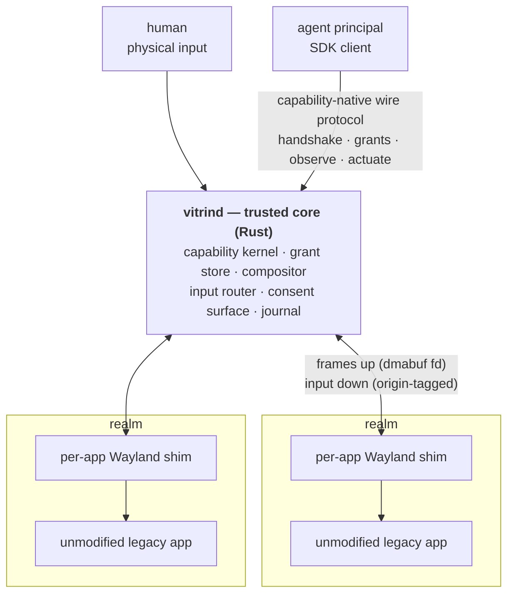

<p align="center">
  
  
</p>

<p align="center">
  <a href="https://github.com/vitrin-os/vitrin-os/actions/workflows/ci.yml"></a>
  <a href="NOTICE"></a>
  <a href="docs/plan/01-phase-1-mvp.md"></a>
</p>

Vitrin OS is an open-source, **agent-first display server**: a small trusted
core (`vitrind`) speaking a new capability-native wire protocol, with every
legacy [Wayland](https://wayland.freedesktop.org/)/X11 application confined to its own per-app nested shim — so
that humans and AI agents can concurrently observe and operate GUIs under
granular, revocable, capability-scoped authorization. Every principal has
identity; every action carries a capability; every action is journaled; the
trusted core stays small and legacy complexity is exiled to disposable,
unprivileged shims.

The full vision, object model, and technical architecture live in
[docs/PRD.md](docs/PRD.md). The wire protocol is specified in
[protocol/vitrin-v0.xml](protocol/vitrin-v0.xml) with prose in
[docs/protocol/](docs/protocol/00-conventions.md).

## What it looks like

One sentence, no jargon:

> An agent is allowed to fill in one form, in one Firefox window, for the
> next five minutes. It cannot see the password manager open beside it. The
> moment you touch the mouse, you have control back. Hold Escape for a
> second and its authority is gone — mid-click, mid-keystroke, whatever it
> was doing.

Every clause there is a mechanism, not a policy setting:

| The claim | What makes it true |
|---|---|
| *allowed to fill in one form* | A **grant**: (principal × resource × verbs × constraints). Not a role, not a config flag — a row in the grant table the core checks on every single action. |
| *for the next five minutes* | Expiry is a constraint **on the grant**, enforced at the chokepoint. There is no path that skips it. |
| *cannot see the password manager* | The agent's Firefox is in a **realm**, talking to its own private nested shim. The other window is not "hidden" from it; it is not in its universe. Scoping is structural. |
| *you touch the mouse, you have control* | Physical input is origin-tagged at the core and preempts agent input **by construction**, not by a race between two clients. |
| *hold Escape and its authority is gone* | The **dead-man switch**: the core revokes every live grant, and the agent's next call fails `revoked`. Proven against a real app in `test_real_deadman.py`. |

The prompt that asks you to approve any of this is drawn by the trusted core
itself — the thing that owns the screen — so no client can paint a fake one
over it. That property has its own gate (`test_real_consent.py`): the prompt
is shown to occlude the app's real pixels while the agent's own capture path
sees the app unchanged.

## Why

Agents that drive desktops today work screenshot-by-screenshot: capture the
screen, pick pixel coordinates, click, capture again. The loop is slow,
token-hungry, and race-prone — and it runs with all-or-nothing authority. The
isolation unit is a whole VM or desktop session, so a single prompt-injected
agent's blast radius is everything on screen. There is no structural way to
say: *this agent may operate this one form in this one app, may not read the
password-manager window beside it, and loses all input the instant a human
touches the keyboard.*

The underlying stack cannot express that sentence. [X11](https://www.x.org/wiki/) grants every client
near-total authority over the session — that is its protocol model, not a
bug. Wayland achieved isolation by *removing* cross-client capabilities
rather than *mediating* them, and its `wl_seat` singleton has no notion of N
concurrent authenticated principals. [AT-SPI2](https://gitlab.gnome.org/GNOME/at-spi2-core), the accessibility tree agents
use to avoid pixels, is an unauthorized backdoor onto every application's
widgets. The managed-cloud answers ([AWS WorkSpaces](https://aws.amazon.com/workspaces/ai-agents/) for AI agents, [Windows 365](https://www.microsoft.com/en-us/windows-365/agents)
for Agents) have the right instinct — identity per agent, audit, oversight —
but at whole-VM granularity, locked to proprietary clouds.

Vitrin is designed from day zero around the missing primitives:

- **Principals.** Every connection authenticates an identity (human or agent
  workload) at handshake; agent credentials are [SPIFFE](https://spiffe.io/)/OIDC-shaped.
- **Grants.** No ambient authority. A grant is (principal × resource × verbs
  × constraints — expiry, rate ceilings, focus conditions), sender-constrained
  to the connection, attenuable, and revocable — immediately and transitively.
- **Consent.** Rendered by the trusted core itself, which owns the screen and
  input, so prompts cannot be spoofed by any client.
- **Realms and shims.** Apps launch into realms; each legacy app gets its own
  private nested shim server, so its universe contains only itself — scoping
  is structural, not policy.
- **Human override.** Physical input preempts agent input by construction.

See [docs/PRD.md](docs/PRD.md) §1 for the full problem statement and §6 for
the pillar-by-pillar requirements.

## Status

**Phase 1 is complete**, and there is a
[**60-second recording**](https://vitrin-os.github.io/vitrin-os/#demo) of it
working: the core-drawn consent card over a real Firefox, a human clicking
Allow, the agent filling a record it was handed, and — in a second take — a
physically held Escape revoking every grant mid-task so the run exits non-zero.
Two takes rather than one, because a revoked run cannot also print `PASS`.

All nine epics (E1–E9) have landed on `main`, and
every milestone's named acceptance gate is closed under the rule this
project holds itself to — decision **D12**: *a milestone closes only when a
named integration test passes green against the shipped binaries with no
mock on any seam it claims.* Component tests built on
[`vitrin-mock-shim`](crates/vitrin-mock-shim) are never that evidence, and
are labelled as what they are.

| Milestone | Gate | Proven by |
|---|---|---|
| **M1.2** — buffer path | [#105](https://github.com/vitrin-os/vitrin-os/issues/105) | `tests/integration/test_real_app.py` — real core + real shim + real `weston-terminal` |
| **M1.3** — observation | [#107](https://github.com/vitrin-os/vitrin-os/issues/107) | `test_real_capture_fidelity.py` — an agent observes a real app through the enforcement chokepoint |
| **M1.4** — actuation, consent, dead-man | [#108](https://github.com/vitrin-os/vitrin-os/issues/108) + [#109](https://github.com/vitrin-os/vitrin-os/issues/109) + [#138](https://github.com/vitrin-os/vitrin-os/issues/138) | `test_real_actuation.py`, `test_real_deadman.py`, `test_real_consent.py` |
| **M1.5** — demo | [#110](https://github.com/vitrin-os/vitrin-os/issues/110) | `test_demo.py` — the demo agent is handed a task record it did not author, fills it into a real app and submits it, and the gate demands the confirmation carry *that record's* 36-bit checksum (a positive content check, not a pixel diff) plus the app's own byte-exact report. The app, `form-target`, is repo-authored — a real Wayland client, no mock, but less independent than the `weston-terminal` it replaced; disclosed in [`examples/agent-demo/README.md`](examples/agent-demo/README.md) and the D12 seam table |

What exists today, on `main`:

- **Protocol spec v0** — [protocol/vitrin-v0.xml](protocol/vitrin-v0.xml)
  (12 interfaces at wire version 2, wire format, error taxonomy; the source of truth), its
  RELAX NG schema [protocol/vitrin-v0.rng](protocol/vitrin-v0.rng), and a
  prose page per interface under [docs/protocol/](docs/protocol/00-conventions.md)
  kept in lockstep with every landing PR.
- **Codegen** — [`vitrin-scanner`](crates/vitrin-scanner) plus
  `cargo xtask codegen` generate the [`vitrin-protocol`](crates/vitrin-protocol)
  Rust crate (message types + codec; pure data, no I/O) and the C header
  [shim/include/vitrin-protocol.h](shim/include/vitrin-protocol.h) from the
  IDL.
- **`vitrind`, the trusted core** ([`crates/vitrin-core`](crates/vitrin-core))
  — a real [Smithay](https://github.com/Smithay/smithay) compositor with both output backends (`--nested`, a host
  Wayland client; `--headless --size WxH`, GPU-less pixman software
  rendering for CI); the capability kernel and in-memory grant table
  (request → pending → consent → resolved, sender-constrained, rate-limited,
  revocable); the realm/spawn manager (fork/exec the shim with a private
  runtime dir and a scrubbed, allow-listed environment); the core-rendered
  consent prompt with an exclusive input grab; the hold-Esc dead-man
  revocation switch; the
  [dmabuf](https://docs.kernel.org/driver-api/dma-buf.html) import path
  ([`dmabuf.rs`](crates/vitrin-core/src/dmabuf.rs) — zero-copy shim→core
  frames on a real GPU, with shm as the universal fallback and an explicit
  `buffer_done(import_failed)` event rather than a silent black frame, so CI
  stays GPU-free); and the flight-recorder log. See the
  [Architecture at a glance](#architecture-at-a-glance) section and
  [docs/ARCHITECTURE.md](docs/ARCHITECTURE.md) for the full crate↔PRD map.
- **The Wayland shim** ([`shim/`](shim/README.md)) — a [wlroots](https://gitlab.freedesktop.org/wlroots/wlroots) headless
  compositor, C + [Meson](https://mesonbuild.com/), outside the Cargo workspace by design. It forwards
  every composited frame to the core over the inherited socketpair, replays
  origin-tagged input into the app through its own `wl_seat`, and runs real
  apps: `weston-terminal`, a [GTK](https://www.gtk.org/) entry probe, and [Firefox ESR](https://www.mozilla.org/en-US/firefox/enterprise/) (pinned),
  climbed one rung at a time and proven in CI with no mock on the shim seam.
- **The agent SDK** ([`sdk/python/`](sdk/python)) — a pure-Python
  (stdlib-only, D8) wire client: connect → handshake → `request_grant` →
  `observe()` → `actuate_pointer`/`actuate_text`, typed grant-error
  exceptions, and capture ergonomics (`.to_png()`).
  [`examples/agent-demo/run_demo.py`](examples/agent-demo/run_demo.py) is
  the demo agent and doubles as the M1.5 integration test; run it with
  `cargo xtask demo` (see [Quickstart](#quickstart) below).
- **CI** — [.github/workflows/ci.yml](.github/workflows/ci.yml): Rust
  fmt/clippy/tests (debug + release), IDL schema validation and
  generated-code drift checking, a Rust-free container build of the C shim,
  golden-frame pixel/SSIM checks, and a headless integration suite that
  drives the real core against real apps (`weston-terminal`, GTK, Firefox
  ESR) with a hard 10-minute budget.

### What Phase 1 does *not* give you

Phase 1 being complete is a statement about a defined slice, not about
readiness for anything real. Read this list before the pitch above
convinces you of more than it should.

- **No sandbox (decision D9, closes in Phase 2).** No namespaces, no
  [seccomp](https://man7.org/linux/man-pages/man2/seccomp.2.html), no
  [Landlock](https://landlock.io/). A realm's app runs as the core's own uid
  with the core's full view of the filesystem and network, and the session
  D-Bus remains reachable. Environment hygiene confines the well-behaved; it
  does not contain the hostile. This is the big one — see
  [Security notes](#security-notes--what-the-mvp-does-and-does-not-confine).
- **The 24-hour fuzz soak has not been run.** `fuzz/` ships two cargo-fuzz
  targets (protocol decode, `vitrin-ipc` framing) with a checked-in corpus
  CI replays on every PR plus a short per-PR burst, but the 24-hour clean
  run the plan asks for is still a manual, documented procedure rather than
  a scheduled job — [fuzz/README.md](fuzz/README.md) says so in its own
  words. Nobody has run it end to end.
- **wlcs conformance is advisory and mostly red:** `total=180 passed=3
  failed=145 skipped=32` on the 2026-07-25 run. That number is expected and
  is not a bug count — [wlcs](https://github.com/canonical/wlcs) tests a
  general-purpose desktop compositor, and the shim deliberately serves a
  narrow surface (no touch, no full `xdg-shell` policy, no decoration
  protocols), so most failures are "no such global" rather than misbehaviour.
  It is still the honest number, it has **not** been re-measured since, and
  `shim/wlcs/README.md` distinguishes the structural absences from the
  genuine ones. Never built by default; never gates a PR.
- **One maintainer.** Governance is a documented BDFL
  ([plan §5](docs/plan/12-workstream-community.md)); bus factor is tracked
  as a first-class project risk, not waved away.
- **v0 protocol, and it will break.** The IDL is frozen for Phase 1, not
  forever — Phase 2 adds semantic trees and epoch/CAS action semantics, and
  v0 clients should expect to move.

Nothing above is discovered-by-a-reader; each is a decision with a recorded
rationale in [docs/plan/20-decision-log.md](docs/plan/20-decision-log.md).

## Quickstart

From a clean clone to a running demo. Verified against the state of `main`
described above (headless venue; the nested venue additionally needs a
Wayland session and Firefox ESR — see the note at the end).

The demo runs the **real** wlroots shim in both venues, so unlike a
Rust-only build it needs the C shim built and a real Wayland client
installed. `cargo xtask demo` fails with the exact `meson` command below if
the shim is missing, rather than silently substituting anything.

```sh
git clone https://github.com/vitrin-os/vitrin-os.git
cd vitrin-os

# The toolchain is pinned (rust-toolchain.toml); rustup installs it on the
# first cargo invocation. System deps the workspace links, plus the C
# shim's build deps and a real Wayland client for it to run:
sudo apt-get install -y libxkbcommon-dev libpixman-1-dev weston   # Debian/Ubuntu
bash shim/ci/install-deps.sh                                      # Meson + wlroots deps

# Build vitrind, xtask, and the fixtures the test suites use.
cargo build --workspace

# Build the real per-app wlroots shim (C + Meson, outside the Cargo
# workspace). cargo xtask demo looks for it at shim/build/vitrin-shim, or
# wherever VITRIN_C_SHIM_BIN points.
meson setup shim/build shim && meson compile -C shim/build

# Run the Phase-1 demo agent headless: boots vitrind --headless, which
# execs the real shim, which fork/execs a real Wayland client (form-target,
# co-built with the shim) in its own confined Wayland socket, and drives
# examples/agent-demo/run_demo.py over a real Unix socket. The agent is
# handed a task record it did not author, locates each form field by its
# marker colour in its own captured frame, clicks, types the value, clicks
# the located submit button, and then decodes the confirmation's three
# receipt bands -- a 36-bit checksum of the record the app received,
# computed from the SUPPLIED task at runtime. Exits non-zero on any failure.
cargo xtask demo --headless

# ... or with a record the agent has never seen:
cargo xtask demo --headless --task name=Grace --task email=grace@example.net
```

Expect output ending in `xtask demo: PASS` and a path to the run's flight
recorder (`flight.jsonl`) and captured frames. This exercises the real wire
protocol, the real capability kernel, the real consent auto-approve path,
the real wlroots shim, and a real app — `vitrin-mock-shim` appears in no
demo venue ([#110](https://github.com/vitrin-os/vitrin-os/issues/110) /
[#127](https://github.com/vitrin-os/vitrin-os/pull/127)); it survives only
as a unit-test fixture for the component tests in `tests/integration/`.

The same chain under the full integration suite, including the named
milestone gates:

```sh
VITRIN_C_SHIM_BIN="$PWD/shim/build/vitrin-shim" bash tests/integration/run.sh
```

**Nested mode** (`cargo xtask demo`, no `--headless`) draws a real window on
your own Wayland session and launches Firefox ESR in the realm — it needs a
running compositor (GNOME, Hyprland, ...) and `firefox-esr` (or
`VITRIN_DEMO_FIREFOX=/path/to/firefox`) on the machine you run it on; it is
never a CI dependency (nested mode has no headless equivalent by design —
plan risk R1).

Other useful commands, all covered in CI:

```sh
xmllint --noout --relaxng protocol/vitrin-v0.rng protocol/vitrin-v0.xml  # validate the IDL
cargo test --workspace && cargo test --workspace --release              # unit + integration tests
cargo xtask codegen --check                                              # generated-code drift check
```

## Architecture at a glance



The core is the entire trusted computing base: capability kernel and grant
store, scene composition, input routing, consent surface, journals. Legacy
apps never touch it directly — each is launched with `WAYLAND_DISPLAY`
pointing only at its own private shim, which is itself an unprivileged client
of the core. Frame buffers move as dmabuf file descriptors over `SCM_RIGHTS`
(zero-copy, one extra IPC hop — the [gamescope](https://github.com/ValveSoftware/gamescope)/[Qubes](https://www.qubes-os.org/) precedent). Window
management policy, decoration, and theming stay out of the core, permanently.

## Security notes — what the MVP does and does not confine

Vitrin's design claims are strong, and the Phase-1 MVP does not yet deliver
all of them. The gaps below are **deliberate, settled decisions with a
scheduled closure**, not oversights — and they are stated here, at the front
of the security story, rather than buried in a module doc, because a
half-believed confinement claim is worse than an honest gap.

**Realm confinement today is environment-structural only.** When the core
launches a realm's app it forks a per-app shim, hands it one end of a
socketpair as its identity (no credential, no handshake — holding the
descriptor *is* being that realm's shim), gives it a private `0700` runtime
directory, and builds its environment from nothing: only names the operator
allow-listed in `realm.toml`, plus a `WAYLAND_DISPLAY` pointing at that
realm's own private socket. `DISPLAY`, the host `WAYLAND_DISPLAY`,
`WAYLAND_SOCKET`, `XAUTHORITY` and the host `XDG_RUNTIME_DIR` cannot reach
the app at all. No unrelated descriptor of the core's — the agent listener,
the flight-recorder log, other realms' sockets, capture memfds — crosses the
fork, and the child starts from a defined signal state rather than inheriting
whatever the operator's shell happened to be ignoring. Both are enforced by
the fork itself (a `close_range` sweep and a disposition reset between `fork`
and `execve`), not by every other module remembering to be careful.

That is the complete list of what confines a realm right now.

- **No sandbox (decision D9, closes in Phase 2).** There are **no
  namespaces, no seccomp filter, and no Landlock policy**. The shim and its
  app run as the core's own uid with the core's full view of the filesystem
  and the network. An app that ignores `WAYLAND_DISPLAY` and connects
  directly to a path it already knows is not stopped by anything in the
  MVP. Real sandboxing arrives with the Phase-2 powerbox (E2.6/E2.7).
  Environment hygiene confines the well-behaved; it does not contain the
  hostile.
- **The session [D-Bus](https://www.freedesktop.org/wiki/Software/dbus/) is reachable (known hole, closes with P13 in Phase
  2).** The core advertises no `DBUS_SESSION_BUS_ADDRESS` and points
  `XDG_RUNTIME_DIR` at the realm's private directory, so a well-behaved
  client finds no bus. But advertisement is not reachability:
  `/run/user/<uid>/bus` is still on the filesystem and still connectable by
  any process of that uid, and the abstract-socket namespace is still
  shared. In practice, running Firefox — the Phase-1 acceptance app —
  means allow-listing `DBUS_SESSION_BUS_ADDRESS` explicitly, which turns
  the implicit hole into an audited one. This is a lateral-escape path of
  exactly the shape [PRD](docs/PRD.md) §15 catalogues (D-Bus activation of a
  privileged helper); **P13** closes it with a loopback-only network
  namespace plus an empty mount namespace, so that there is nothing to
  reach rather than nothing advertised.
- **Same-uid separation is not attempted.** The `0700` runtime directory
  bounds other *users* on the machine, not other processes of this user.
  Note what the realm's `XDG_RUNTIME_DIR` therefore is and is not: its value,
  `$XDG_RUNTIME_DIR/vitrin-0/<realm>`, sits one level below the directory
  holding the core's own agent socket and this run's flight-recorder log, so
  it names the control plane as much as it hides it. Redirecting it means a
  well-behaved client finds its own realm's socket instead of the host
  session's — it does not mean the app cannot reach the rest, because under
  D9 it runs as the core's uid and can derive those paths with or without a
  variable pointing at them.

The spawn path and every decision above are documented in full in
[`crates/vitrin-core/src/spawn.rs`](crates/vitrin-core/src/spawn.rs);
`realm.toml`'s own security rules are in
[`examples/realm.toml`](examples/realm.toml).

## Repository layout

| Path | What it is |
|---|---|
| [`docs/PRD.md`](docs/PRD.md) | PRD + Technical Architecture — the canonical vision/design doc |
| [`docs/ARCHITECTURE.md`](docs/ARCHITECTURE.md) | Maps every crate/directory below to the PRD section it implements |
| [`protocol/vitrin-v0.xml`](protocol/vitrin-v0.xml) | The wire-protocol IDL — source of truth for every interface |
| [`protocol/vitrin-v0.rng`](protocol/vitrin-v0.rng) | RELAX NG schema for the IDL dialect |
| [`docs/protocol/`](docs/protocol/00-conventions.md) | Normative conventions + one prose page per interface, kept in lockstep with the IDL |
| [`docs/plan/`](docs/plan/README.md) | Phase/epic/task breakdown, decision log, roadmap |
| [`docs/demo/`](docs/demo/README.md) | The demo screencast — the recorded artifact, what it shows, and the operator runbook |
| [`crates/vitrin-core/`](crates/vitrin-core) | `vitrind` — the trusted core (compositor, capability kernel, grant store, realms, consent) |
| [`crates/vitrin-protocol/`](crates/vitrin-protocol) | Generated message types + codec (no I/O, no sockets) |
| [`crates/vitrin-scanner/`](crates/vitrin-scanner) | Code generator: IDL XML → Rust + C header |
| [`crates/vitrin-ipc/`](crates/vitrin-ipc) | Unix-socket transport: framing, `SCM_RIGHTS`, `SO_PEERCRED`, backpressure policy |
| [`crates/vitrin-mock-shim/`](crates/vitrin-mock-shim) | Fixture-only shim stand-in for component tests. Never a demo venue and never milestone evidence (plan §5 D12) |
| [`crates/vitrin-golden/`](crates/vitrin-golden) | Per-pixel + SSIM frame comparison, used by the golden and real-app fidelity tests |
| [`crates/xtask/`](crates/xtask) | `cargo xtask codegen [--check]` / `bless` / `demo [--headless]` |
| [`shim/`](shim/README.md) | The wlroots-based per-app Wayland shim (C + Meson, outside the Cargo workspace) |
| [`sdk/python/`](sdk/python) | The pure-Python agent SDK (`vitrin_os` package, D8) |
| [`examples/agent-demo/run_demo.py`](examples/agent-demo/run_demo.py) | The Phase-1 demo agent — also the M1.5 integration test, run via `cargo xtask demo` |
| [`tests/integration/`](tests/integration/README.md) | Drives the shipped `vitrind` binary + real shim + real apps over a real socket |
| [`.github/workflows/ci.yml`](.github/workflows/ci.yml) | CI: schema validation, Rust + C tests, codegen drift check, headless integration suite |

## Working with the repo today

The toolchain is pinned to Rust **1.94.1** in
[rust-toolchain.toml](rust-toolchain.toml); rustup installs it automatically
on the first `cargo` invocation. The pin is exact rather than `stable`
because `cargo xtask codegen --check` compares generated output byte-for-byte
and that output depends on rustfmt's exact formatting decisions (the codegen
shells out to `rustfmt`; the pinned toolchain's default profile ships it).
The crates' MSRV is 1.87. CI builds with `RUSTFLAGS="-D warnings"`.

```sh
# Validate the IDL against the RELAX NG schema (requires xmllint/libxml2)
xmllint --noout --relaxng protocol/vitrin-v0.rng protocol/vitrin-v0.xml

# Build and test the workspace — CI runs both debug and release
cargo test --workspace
cargo test --workspace --release

# Check that the generated Rust crate and C header match the IDL
cargo xtask codegen --check

# Regenerate them after editing protocol/vitrin-v0.xml
cargo xtask codegen

# C header: standalone compile + golden-frame check against the Rust codec
cc -std=c11 -Wall -Werror -I shim/include -c shim/tests/test_header_compiles.c -o /dev/null
cc -std=c11 -Wall -Werror -I shim/include shim/tests/test_golden_frames.c -o /tmp/golden && /tmp/golden
```

## Protocol v0 interfaces

The wire format (little-endian frames, 8-byte header, at most one fd per
message), object-id rules, ordering guarantee, error taxonomy, and versioning
rules are defined in [00-conventions.md](docs/protocol/00-conventions.md).
There are two connection classes sharing one wire format: agent principals on
the core's listening socket, and per-app shims on a core-inherited
socketpair. A grant petition co-mints the grant, a consent observer, and the
facets (view, pointer, text) in one request; every facet added after version 1
arrives instead as a structural mint on the grant, because `request_grant`'s
five `new_id` arguments are frozen forever. Facets are born inert and confer
nothing until the grant resolves. Where prose and IDL disagree, **the IDL's
`<description>` text wins.**

| Interface | Purpose |
|---|---|
| [`vitrin_handshake`](docs/protocol/01-vitrin_handshake.md) | Principal connection bootstrap: version + identity hello, resolving to a bound principal |
| [`vitrin_principal`](docs/protocol/02-vitrin_principal.md) | The authenticated principal — root of the connection's authority chain |
| [`vitrin_realm`](docs/protocol/03-vitrin_realm.md) | Realm address — an authority-free scope handle (`realm-0` is the well-known realm and is always served; a deployment may configure more) |
| [`vitrin_grant`](docs/protocol/04-vitrin_grant.md) | Capability handle — the wire projection of one grant-table row; born pending, resolved exactly once |
| [`vitrin_consent`](docs/protocol/05-vitrin_consent.md) | Consent-prompt visibility for one petition (events only, no authority) |
| [`vitrin_view`](docs/protocol/06-vitrin_view.md) | Observation facet — poll-model frame capture |
| [`vitrin_actuator_pointer`](docs/protocol/07-vitrin_actuator_pointer.md) | Pointer actuation facet |
| [`vitrin_actuator_text`](docs/protocol/08-vitrin_actuator_text.md) | Text actuation facet |
| [`vitrin_shim_session`](docs/protocol/09-vitrin_shim_session.md) | Shim connection bootstrap |
| [`vitrin_shim_surface`](docs/protocol/10-vitrin_shim_surface.md) | Shim-to-core buffer path |
| [`vitrin_shim_seat`](docs/protocol/11-vitrin_shim_seat.md) | Input delivery to the shim (events only, origin-tagged) |
| [`vitrin_launcher`](docs/protocol/16-vitrin_launcher.md) | Realm-launch facet (since wire version 2) — fork a new realm instance from an operator-written template, under a core-minted id; `launch` carries no arguments, so the command never crosses the wire |
| [`vitrin_layout_focus`](docs/protocol/17-vitrin_layout_focus.md) | Focus facet (since wire version 2) — bind the output to the granted realm and send the human's own input there, one act |
| [`vitrin_layout_arrange`](docs/protocol/18-vitrin_layout_arrange.md) | Arrangement facet (since wire version 2) — fill the output, or compose at the app's own size; `place`, `resize`, `raise` and stacking are absent rather than refused |

## Roadmap

Condensed from [docs/PRD.md](docs/PRD.md) §8:

- **Phase 0 — Spec & manifesto.** Vision, object model, wire-protocol draft
  (the PRD in this repo).
- **Phase 1 — MVP slice** *(complete)*. Trusted core (headless + nested), one
  wlroots Wayland shim, Firefox in a realm, and an agent that captures the
  realm and injects scoped input — gated by a single grant with consent
  rendered by the core.
- **Phase 2 — Semantic + epochs** *(next)*. [AccessKit](https://accesskit.dev/)/AT-SPI2 bridge, versioned and
  diffable semantic trees, epoch/CAS action semantics, VLM fallback for
  treeless surfaces, native semantic demo app, filesystem powerbox v0,
  network authority v0 (per-realm loopback-only netns, egress as a grant).
- **Phase 3 — Network + X11 + fleet.** [QUIC](https://www.rfc-editor.org/rfc/rfc9000) network sessions, per-app X11
  shim with embedded WM, multi-realm headless fleet mode, journal replay
  tooling, synthetic-path FUSE layer, credential wallet v0, mission-control
  shell v0.
- **Phase 4 — Horizon.** Session mode on bare DRM/KMS, Flutter/iced/egui
  semantic backends, capability-remoting protocol hardened for third-party
  clients, EUDI/OID4VC conformance — entered only when adoption justifies the
  support burden.

## Contributing

Work is tracked as GitHub issues in
[vitrin-os/vitrin-os](https://github.com/vitrin-os/vitrin-os/issues). Phase 1
is split into nine epics, each carrying exactly one `track:*` label
(`track:protocol`, `track:rust-core`, `track:c-shim`, `track:sdk`,
`track:ci-docs`), sequenced by milestones `M1.1`–`M1.5`.

- **Branches**: `p<phase>.<epic>.<task>-slug`, e.g. `p1.1.1-protocol-idl`.
- **Commits**: [Conventional Commits](https://www.conventionalcommits.org/),
  `type(scope): summary`, where scope is the track (`protocol`, `rust-core`,
  `c-shim`, `sdk`, `ci-docs`) or `root`. Reference the tracking issue in the
  footer (`Closes #10` / `Refs #10`).
- **Protocol changes are paired edits, never one alone**: change
  `protocol/vitrin-v0.xml` (and `protocol/vitrin-v0.rng` only if the dialect
  itself changes) together with the matching `docs/protocol/NN-*.md` page,
  then validate with `xmllint --noout --relaxng protocol/vitrin-v0.rng
  protocol/vitrin-v0.xml`. After IDL edits, run `cargo xtask codegen` and
  commit the regenerated code in the same change.
- **Language**: English only — code, docs, commits, issues, PRs.

## License

Split per decisions D-005 and D-016 (`docs/plan/20-decision-log.md`).
[`NOTICE`](NOTICE) is the normative path→license map; the
`SPDX-License-Identifier` header on a file is authoritative for that file.

- **Apache-2.0** ([`LICENSE`](LICENSE)) — the protocol
  ([`protocol/vitrin-v0.xml`](protocol/vitrin-v0.xml),
  [`protocol/vitrin-v0.rng`](protocol/vitrin-v0.rng)), the bindings
  generated from it (`crates/vitrin-protocol`,
  `shim/include/vitrin-protocol.h`), the code generator that emits them and
  its driver (`crates/vitrin-scanner`, `crates/xtask`), the conformance and
  fuzz instruments, the
  **client SDKs** ([`sdk/python/`](sdk/python)), the integration harness
  ([`tests/integration/`](tests/integration)) and the shipped
  [`examples/`](examples).
- **MPL-2.0** (`LICENSE-MPL-2.0`) — the reference implementation:
  `crates/vitrin-core` (the trusted core), `crates/vitrin-ipc`, and the
  per-app Wayland shim under [`shim/`](shim).
- **CC-BY-4.0** ([`LICENSE-CC-BY-4.0`](LICENSE-CC-BY-4.0)) — spec prose
  ([`docs/PRD.md`](docs/PRD.md), [`docs/protocol/`](docs/protocol),
  [`docs/plan/`](docs/plan)).
- **GPL-3.0-only** (`LICENSE-GPL-3.0-only`) — one carve-out,
  [`shim/wlcs/`](shim/wlcs), the advisory [WLCS](https://github.com/canonical/wlcs) conformance module, which
  links GPL-3.0 headers from Canonical's wlcs. It is never built by
  default, never installed, and never linked into `vitrin-shim`.

**What that means for you, plainly:** you never have to touch an MPL-2.0
file to write a client, build an alternate compositor or shim, or ship an
integration — the protocol, the generated bindings, the codegen and the
SDKs are all Apache-2.0, patent grant included. The copyleft binds one
group only: people who modify the trusted core itself, whose changes to a
capability kernel should come back. MPL's copyleft is per-file, so
applications running under Vitrin are unaffected — running an app inside a
shim does not make it derivative of anything here.

**No CLA.** Contributions are taken under the
[Developer Certificate of Origin](https://developercertificate.org/)
(a `Signed-off-by:` line), not a Contributor License Agreement — decision
D-012. Nobody is asked to assign copyright: contributors keep theirs, and
the project never acquires the unilateral power over *their* code that a
CLA would hand it. That is deliberate — it is what stops the split above
from being merely this year's mood.

**No patents.** Vitrin OS files none and intends to file none (D-015). The
design is protected by publishing it — a timestamped spec is itself the
prior art — and by the Apache-2.0 §3 and MPL-2.0 §2.1(b) patent grants that
ship with the code. Both are in force today. A third leg, joining the [Open
Invention Network](https://openinventionnetwork.com/)'s royalty-free cross-licence, is decided but **not yet
done**. None of this is a patent wall, and none of it is a
freedom-to-operate opinion.
